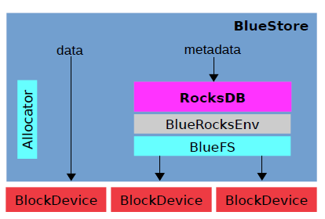

# Ceph 后端存储引擎

## FileStore
> `FileStore` 需要兼容 `Linux` 下的各种文件系统，如 `Ext4`、 `XFS`，理论上每种文件系统都实现了 `Posix` 协议，但事实上，每个文件系统都有一点"不那么标准"的地方，Ceph的实现非常注重可靠性，因而需要为每种文件系统引入不同的 `Walkround` 或者 `Hack`， 例如 `Rename` 不幂等性，等等。这些工作的不断开发带来了很大负担。
>
> 其次，`Posix` 提供了非常强大的功能，但大部分并不是 `ceph` 真正需要的，这些功能成了性能的累赘，另一方面，文件系统的某些功能实现对 `Ceph` 并不友好，例如对目录遍历顺序的要求，等等
> 
> 另一方面，是 `ceph` 的双写问题，为了保证写入过程中断电恢复，一集为了实现单 `OSD` 内的事务支持，在 `FileStore` 的写路径中，`Ceph` 首先把数据和元数据修改写入日志，日志完成后，再把数据进行落盘，这种预写日志的方法(WAL) 是数据库和文件你那系统标准保证 `ACID` 的方法，但用在 `ceph` 上，带来了以下问题：
>
> 1) 数据被写了两遍，即日志双写问题，这意味着 `ceph` 牺牲了一般的磁盘吞吐量
>
> 2) Journaling of Journal问题，`Ceph` 的 `FileStore` 做了一遍日志，而 `Linux` 文件系统本身也有日志机制，实际上日志被多做了一遍
>
> 3) 对于新型的 `LSM-Tree` 类存储，如 `RocksDB`、 `LevelDB` 由于数据本身就是按照日志形式组织，实际上没有再另加一个单独的WAL的必要。
>

### 读流程
1. ceph 客户端通过计算得出主 OSD，直接给主 OSD 发送消息

2. 主 OSD 受到消息后，调用 FileStore 直接读取处在底层文件系统中主 pg 里的内容然后返回给客户端

### 写
1. 客户端发送数据至主 OSD

2. 主 OSD 要进行写操作预处理，完成后发送写消息至其他从 OSD，让他们对副本 pg 进行更改

3. 从 OSD 通过FileJournal完成写操作到Journal中后发送消息告诉主 OSD 

4. 当主 OSD 收到所有的从 OSD 完成写操作的消息后，会通过FileJournal完成自身的写操作到Journal中。完成后会通知客户端，已经完成了写操作

5. 主 OSD，从 OSD 的线程开始工作调用Filestore将Journal中的数据写入到底层文件系统中。

## BlueStore
BlueStore是在底层裸设备上建立存储系统，抛弃了 `ext`、 `xfs` 等文件系统，避免了数据映射特定文件系统结构的开销，内建了 `RocksDB k/v` 数据库用于管理内部元数据，一个小型的内部接口组件 `BlueFS` 实现了类似文件系统的接口，以便提供足够功能让 `RocksDB` 来存储它的数据并向 `BlueStore` 共享相同的裸设备

### 特性
* 直接管理存储设备，使用原始块设备或分区，避免了任何可能限制性能或者增加复杂性的中间抽象层

* 不需要 `POSIX` 文件系统，使用一个专门为 `RocksDB` 设计的文件系统 `BlueFS` 来存储数据

* 元数据以 `k/v` 形式存储在 `RocksDB` 中，例如从对象名到磁盘的块位置的映射，而数据不需要文件系统

* 完整数据和元数据校验和，默认情况下，写入 `BlueStore` 的所有数据和元数据都受一个或多个校验和的保护，在未经验证的情况下，不会从个磁盘读取数据或元数据将其返回给用户

* 内联压缩，在数据写入磁盘钱，可以选择压缩写入的数据

* 多设备元数据分层，`BlueStore` 允许将内部日志(WAL) 写入单独的高速设备(例如SSD、NVME或NVDIMM) 以提高性能，如果有大量更快的存储空间可用，内部元数据也可以存储在速度更快的设备上

* 高效的写时复制，RBD与CephFS快照依赖于 `BlueStore` 高效实现的写时复制克隆机制。

### 多设备
`BlueStore` 可以组合慢速和快速设备，类似 `FileStore`， 更多的使用快速设备，在 `FileStore` 中，日志设备只用于写，通常位于较快的 `SSD`。

`BlueStore` 最多可以管理3种存储设备
1. 最简单的情况，`BlueStore` 使用单个存储设备，将其当作一个整体使用，存放WAL日志、DB、以及元数据和对象数据

2. 使用单独的、性能更好的设备来作为 `DB` 的存储设备，单独存储有 `BlueStore` 内部产生的元数据，可由普通的 `SSD` 提供

3. 使用单独的设备(SSD 或 NVRAM)来存储 `RocksDB` 内部产生的 `.log` 文件(WAL)，

#### 写路径
1. 写新数据至新分配的区域，因此不会覆盖已有数据，考虑ACID，即使中途断电，因为`RocksDB` 中的元数据没有更新，不用担心ACID语义呗破坏，因此，是不需要日志的，在数据写完之后，元数据更新写入到 `RocksDB`，`RockDB` 本身支持事务，元数据更新作为 `RocksDB` 的事务提交即可

2. 日志写入Blob中的新位置，不需要日志

3. 覆盖写是需要考虑日志问题，如果新写比块大小更小，那么会将其元数据合并写入到 `RocksDB` 中之后异步的把数据搬到实际落盘位置，这就是日志了，如果新写块大小更大，分割后写入新分配的块中

参考：
* https://cloud.tencent.com/developer/news/45599