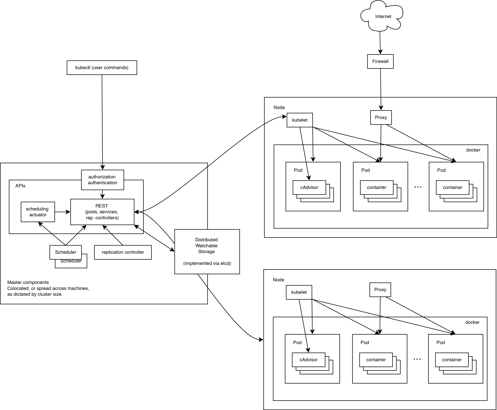

## Docker
##### OCI：开放式容器镜像；
##### OCF：开放式容器格式；
#### LXC：LinuX Container
	chroot：根切换；
	namespace：名称空间；
	CGroups：控制组；

#### 虚拟化：
	主机虚拟化：
		Type 1：直接在硬件上运行VMM；
		Type 2：在OS上运行VMM，每个虚拟机都有自己的内核；

##### 虚拟机的隔离性：
	每个虚拟机都有自己的用户空间、网络空间、进程树、根文件系统、UTS空间；（由容器技术的名称空间实现）；
	控制组：能控制每个虚拟机所能使用的资源，将物理机的资源进行切割；

##### 容器：
	利用chroot、namespace、CGroup等技术实现用户空间的隔离、主机资源的切割与控制；
##### 	容器的主要目的：
	隔离进程；
	名称空间：
		IPC
		UTS
		Mount
		Pid
		Network
		User
		...

	LXC的每个用户空间仅提供了应用程序运行时所依赖的库以及程序本身；
docker其实就是容器技术的前端管理工具；	


Docker
	前期：docker只是lxc的更易用的前端管理器；


###### Docker每个容器只用于一个进程；
	好处：利于分发；


### lxc简单应用 

1. 安装：
```
~]# yum -y install  lxc  lxc-templates  
```

##### 命令：
* lxc-checkconfig：检查lxc运行环境；
* xc-ls, lxc-create：创建lxc container；
* lxc-start：启动容器； 
* lxc-console：关联至某个容器的终端界面；
* lxc-stop：停止一个容器； 
* lxc-info：显示一个容器的详细信息；
* lxc-clone：克隆一个容器；
* lxc-snapshot：对某个容器做快照管理；
* lxcdestroy：删除某个容器；
* ...

#### WebGUI：lxc-webapanel：
```
~]# yum -y install python-flask
~]# git clone https://github.com/lxc-webpanel/LXC-Web-Panel.git 
~]# python LXC-Web-Panel/lwp.py 
```

#### Docker的三个组件：
	1. Registry：镜像仓库；
	2. Docker_Host：
		* Containers：
		* Images：
	3. Client：


##### docker daemon：
* 接收并管理对docker daemon API接口发起的对docker object的各种管理请求
##### docker object：	
* images
* containers
* networks
* volumes

#### docker client：
* 用户与docker交互的命令行工具；

#### docker registries：
* 用来存储docker images的一个镜像仓库；
* 一个registries可以有多个仓库；
* docker的组成：
	* index 

###### docker删除文件，只是将文件标记为不可用而已； 

### Images：
##### Docker镜像含有启动容器所需要的文件及其内容，因此，其用于创建并启动docker容器；

###### 采用分层构建机制，最底层为bootfs，其上为rootfs，
`bootfs：用于系统引导的文件系统，包括bootloader和kernel，容器启动完成后会被卸载，以节约内存资源；`
`rootfs：位于bootfs之上，表现为docker容器的根文件系统；`
```
1. 传统模式中，系统启动时，kernel会以"只读"方式挂载rootfs，当系统完成自检后，会再以"读写"方式重新挂载rootfs；
2. 在docker中，rootfs由内核挂载为"只读"模式，而后通过联合挂载技术，在镜像的最上方额外附加一个"读写"层；
```
* 每个镜像都是一个只读的模板；docker利用联合文件系统来组织镜像，每个镜像下载到本地都是只读的，当基于此镜像启动容器时，会在此基础镜像的最上层，附加一个读写层，利用cow机制（相当与快照的理念，当需要修改镜像中的文件时，会先将镜像中的文件复制出来一份到最上层的读写层，在读写层完成修改，而不会直接在底层镜像中修改）；

* 每个镜像都是基于它的底层镜像构建出来的，以及附加一些额外的功能； 
 
##### Devicemapper：
* Device Mapper是Linux2.6内核中支持逻辑卷管理的通用设备映射机制，它为了实现用于存储资源管理的块设备驱动提供了一个高度模块化的内核架构；

##### Docker Registry的分类：
* 官方Docker Hub：官方Registry；
* Sponsor Registry：第三方；
* Mirror Registry ：第三方；
* Vendor Registry：由发布Docker镜像的供应商提供的Registry
* Private Registry：私有Registry

#### Registry(repository and index)：
```
1. 由某个特定的docker镜像的所有迭代版本组成的镜像组合；
2. 一个Registry中存在多个Repostory
	repository分为“顶层仓库”和“用户仓库”
	用户仓库名称格式“用户名/仓库名”；
3. 每个仓库可以包含多个Tag（标签），每个标签对应一个镜像；
```
#### Index：
```
1. 维护用户账号、镜像的效验以及公共命名空间信息；
2. 相当于Registry提供了一个完成用户认证等功能的检索接口；
```
* 使用镜像用pull从镜像仓库拉取镜像，或从远程仓库中pull镜像；

 push可以将制作好的镜像文件推送到本地镜像仓库或远程镜像仓库；

### Docker Image Layer：
* 位于下层的镜像称为父镜像，(Parent image)，最底层的称为基础镜像(Base image)；
* 最上层的为"可读写"层，其下的均为"只读"层；

### Containers：
* 一个容器就是一个运行中的镜像；
* 可以按照自己的需要启动、停止、删除一个容器；

Docker的运行环境：
*  64 bits CPU
*  Linux Kernel 3.10+
*  Linux Kernel cgroup and namespace 


docker命令：
* run：
	* -i：交互式启动；
	* -t：分配一个tty；
	* --name：为要启动的容器设置一个名字；
	* --rm：在容器关闭是删除容器；
	* -v 挂载本地路径到容器中，做为容器的卷；
		* 容器的卷挂载有两种方式，一种是直接指定容器中的路径，docker会自动在/var/lib/docker/volume/下创建一个对应的路径，可通过docker volume  -f   {{.Mounts}}  CONTAINER 来显示容器挂载的卷；
		* 另一种方式则是手动指定挂载路径；在-v指定卷的时候以":"分隔指定两个路径，前一个为Docker Host中的路径，另一个则为Dcoker Container中的路径；
	* --hostname  `<host>:<ip>`：启动容器时指定容器的主机名；
	 * --dns：为容器指定DNS地址；
	* --add-host：为容器的hosts文件添加一条解析项；
	* -p：指定端口号，将容器的指定端口暴露出来（实际上是在宿主机的netfilter上生成一条DNAT规则，实现端口映射）
		* 暴露端口有4中暴露方式：
		
		`1. 宿主机的所有地址的随机端口映射容器的指定端口：
		-p <Container_port>`

		`2. 宿主机上的所有地址的指定端口映射到容器的指定端口：
		-p <Host_port>:<Container_port>`
		
		`3. 宿主机上的指定IP的随机端口映射到容器的指定端口：
		-p <IP>::<Container_port>`
		
		`4. 宿主机上指定IP的指定端口映射到容器的指定端口：
		-p <IP>:<Host_prot>:<Container_prot>`
		
	* -P --expose `<port>`：一对一暴露容器的端口，多个端口每个端口用--expose来引导；


* import：导入一个tar格式的镜像文件；
* export：导出容器为tar格式的镜像文件；
* load：装载一个image镜像文件 `-i`;

#### 镜像相关的操作：
* 镜像的生成途径：
```
	1. Dockerfile
	2. 基于容器操作
	3. Docker Hub automated builds
```

##### 基于容器制作镜像:
```
~]# docker commit 
#格式：docker commit [OPTIONS] CONTAINER [REPOSITORY[:TAG]]
	OPTIONS:
		-p：暂停容器；
		-a：指定制作者信息；
		-c：改变Container默认运行的程序；
		#格式：
			'CMD ["exec","param1","param2"]'
#启动容器：
~]# docker run  -it --name test1 <IMAGE>
#基于容器创建镜像：
~]# docker commit -p -a "zero <zero@magedu.com>" test1 new_image:tag

#指定容器启动时默认运行的命令：
~]# docker commit -p -a "zero <zero@magedu.com>" -c 'CMD ["httpd","-DFOREGROUND"]' test1 new_image:tag
```

#### 基于Dockerfile创建镜像：
* 基于Dockerfile的源码文件构建出一个docker images
* dockerfile的每一条指令都会为docker镜像生成一层镜像层；

#### Dockerfile Format：
* 整个dockerfile文件都是有注释行与指令行组成；构建镜像时会按照dockerfile中指令的顺序逐条执行，每一条指令都会为docker镜像构建一层新的镜像层
* Dockerfile的第一个非注释行必须为`FROM`

* Dockerfile中的变量：
	* ENV 指令用于定义变量；
	* 引用变量同bash中的引用方式，可以使用
	`${Variable_name}`
	`$Variable_name`
	也支持变量的修正：
	`${variable_name:-word}`：如果变量存在且不空，则使用变量自己的值，否则，则使用word的值；
	`${variable_name:+word}`：如果变量存在且不空，则使用word的值，否则，则返回错误；

---

* FROM：
	* FROM指令最重要的且必须为Dockerfile文件开篇第一个非注释行，用于为镜像文件构建过程指定基础镜像，后续的指令运行于此基础镜像所提供的运行环境；
	* 基础镜像可以为任何可用的镜像文件，默认情况下，docker build会在docker主机上查找指定的镜像文件，在其不存在时，则会从Docker Hub Registry上拉取所需要的镜像文件；
	* 如果找不到指定的镜像文件，docker build会返回一个错误信息；

	* Syntax：
		* FROM `<image>[:<tag>]`
		* FROM `<image>@<digest>`
			* image：指定基础镜像；
			* tag：base image的标签，为可选向，省略是默认为latest；
			* digest：指定效验码； 
* MAINTANIER：
	* 用于提供镜像制作者提供本人的详细信息；
	* Syntax：
		* MAINTANIER <authtor's detail>
		<authtor's detail>可以为任何文本信息；

* COPY：
	* 用于从Docker主机复制文件至创建的新镜像文件中；
	* Syntax：
		* COPY `<src>...<dest>`
		* COPY `["<src>",..."<dest>"]`
			*  `<src>`：要复制的源文件或目录，支持通配符；
			* `<dest>`：目标路径，即正在创建的image的文件系统路径；建议`<dest>`使用绝对路径，否则，COPY指定则以WORKDIR为起始路径；
* 注：在路径中有空白字符时，通常使用第二种格式；

* ADD ：
	* 此指令支持URL文件路径；如果源文件为多个文件，则目标路径必须以/结尾；

* VOLUME：
	* Syntax：
		* VOLUME `<mountpoint>`或
		* VOLUME `["<mountpoint>"]`
	* 此类卷是由Docker管理的卷；

* EXPOSE：
	* 用于为容器打开指定要监听的端口以实现与外部通信；
	* Syntax：
		* EXPOSE `<port>[/<protocol>][<port>[/<protocol>]...]`

* 示例Dockerfile：

```
FROM busybox:latest
MAINTAINER "twoling <twoling@magedu.com>"
VOLUME /data/httpd		#由Docker随机挂载一个卷；
EXPOSE 80/tcp			#为容器打开某指定端口实现与外部通信；
```

* 打开容器的指定端口需要在运行docker容器时指定-p或-P选项；

* ENV：用于为镜像定义所需的环境变量，并可被Dockerfile文件中位于其后的其他指令（如ENV、ADD、COPY等指令）调用；
* 调用格式：`$variable_name或${variable_name}`
* Syntax：
	* `ENV <key> <value>或
		ENV <key>=<value>`
* 设置多个变量时建议用第二种方式，可以在一层镜像上完成所有变量的设定；

* 示例Dockerfile：
```
FROM busybox:latest
MAINTAINER "twoling <twoling@magedu.com>"
ENV doc_root="/data/httpd"
VOLUME ${doc_root}		#调用ENV所定义的变量；
EXPOSE 80/tcp			#为容器打开某指定端口实现与外部通信；
```

* RUN：
	* 用于指定docker build过程中运行的程序，其可以是任何命令；
	* Syntax：
		* `RUN <command>或RUN ["<exectable>","<param1>","<param2>"]`

* ENTRYPOINT：
	* 与CMD命令类似，都是定义容器运行时默认运行的程序；
	* Dockerfile文件中也可以存在多个ENTRYPOINT，但只有最后一个生效；

* USER：
	* 用于指定运行镜像时的运行Dockerfile中任何RUN、CMD或ENTRYPOINT指令指定的程序时的用户名或UID；
	* 默认情况下，Container的运行身份为root用户；
	* Syntax：
		* `USER <UID>|<UserName>`
		* 注意：UID可以为任意数字，但必须为/etc/passwd文件中存在的某用户的有效UID，否则，Docker run命令将运行失败；

* ONBUILD：
	*  Dockerfile用于build映像文件，此映像文件亦可作为base image被另一个Dockerfile用作FROM指令的参数，并以之构建 新的映像文件 
	*  在后面的这个Dockerfile中的FROM指令在build过程中被执行时 ，将会“触发”创建其base image的Dockerfile文件中的 ONBUILD指令定义的触发器 
	*  Syntax：
		*  ONBUILD`<INSTRUCTION>`

#### 构建镜像：
```
#需要在Dockerfile文件所在的目录中执行以下命令；
~]# docker build [OPTION] PATH | URL
OPTION:
	-t：指定构建镜像文件的标签；
#示例：
~]# docker build -t test/test:v1 ./ 
```
---

* 给镜像打标：
```
#格式：
~]# docker tag IMAGE[:TAG] IMAGE[:TAG]
#示例：
~]# docker tag fc4a819703db twoling/centos:net-tools
```

* 导出一个镜像文件：
```
#格式：
~]# docker save [OPTION] IMAGE[:TAG]
	-o：指定镜像输出的文件；
#示例：
~]# docker save -o centos7 twoling/magedu:centos
```

* 导入一个镜像文件：
```
#格式：
~]# docker load [OPTION] 
	-i：指定输入文件（默认从STDIN读取输入）；
#示例：
~]# docker load -i centos7
```
#### Docker Data Volume：
* 卷为docker提供了独立于容器的数据管理机制； 
* 卷实现了"程序(镜像)"和"数据(卷)"的分离，以及"程序(镜像)"和"制作镜像的主机"分离，用户制作镜像时无需在考虑镜像运行的容器所在的主机的环境；

* Docker镜像是由多个只读层叠加而成，启动容器时，Docker会加载只读镜像层并在镜像栈顶部添加一个读写层；如果运行中的容器修改了现有的一个已经存在的文件，那么该文件将会从读写层下面的只读层复制到读写层，该文件的只读副本仍然存在，只是已经被该文件在读写层的副本所隐藏；此即"写时复制（cow）"机制； 


##### 将httpd运行于前台：
	选项：-DFOREGROUND
##### 将Nginx运行于前台：
	-g "daemon off;"

### Sharing Volume：
1. 多个Container使用同一个主机目录；
2. 复制一个容器的卷；
	--volumes-from `<Container>  <Images>`
	docker rm -v 

##### docker的网络默认为NAT模式

docker的四种网络模型：
1. 封闭式容器；
2. 桥接式容器；
3. 联盟式容器；
```
多个容器共享同一个网络名称空间；
```
4. 开放式容器；

#### 创建联盟式容器：
```
#创建一个容器:
~]# docker run -it --rm --name c1 centos:net-tools
#创建另一个容器，附加c1的网络名称空间至此容器；
~]# docker run --it --rm --name c2 --network container:c1 centos:net-tools
注：--rm的作用是在容器退出时删除此容器；
```


### Docker Registry：
##### registry的组成格式：
1. index：索引文件，存放着此Registry的所有镜像仓库的索引以及访问本Registry的所有用户账号和口令等信息；
2. 存储系统：存放用户向此Rgistry上push的所有镜像；

##### Docker-Registry：docker官方提供的供用户自建registry的项目；

#### 自建Registry：
1. 安装docker-registry：
```
~]# yum -y install docker-registry	#安装后的软件包名为：docker-distribution，也可直接安装docker-distribution，为同一个包；
```
2. 启动docker-distribution
```
#docker-distribution的配置文件：/etc/docker-distribution/registry/config.yml
~]# cat /etc/docker-distribution/registry/config.yml
version: 0.1
log:
  fields:
    service: registry
storage:
    cache:
        layerinfo: inmemory
    filesystem:
        rootdirectory: /var/lib/registry  #此处指定push上来的镜像文件存放的路径，如有需要直接在此修改即可；
http:
    addr: :5000   #监听的端口；
#启动registry
~]# systemctl start docker-distribution
~]# ss -tanl
...
LISTEN      0      128       :::5000       :::* #看到监听的端口
...
```
3. 客户端尝试push镜像到私有registry，默认docker在push镜像时会按照docker image 的tag来指定上传的服务器，如果docker image tag没有明确指定registry服务器，默认会往docker hub上推；
```
#先为一个现有的镜像修改tag；
~]# docker tag centos:latest  172.18.54.3:5000/centos:latest
#此时如果直接push镜像则会出错，会提示"Get https://172.18.54.3:5000/v1/_ping: http: server gave HTTP response to HTTPS client"，默认push时会使用安全的HTTPS来进行传输，如果无法建立HTTPS连接则会报错，解决方法：
echo "INSECURE_REGISTRY='--insecure-registry 172.18.54.3:5000'" >> /etc/sysconfig/docker  也可以直接编辑配置文件，此行的意思为docker添加一个不安全的registry；即不用走https加密；
~]# systemctl restart docker
~]# docker push 172.18.54.3:5000/centos:latest
```

##### 使用nginx反代registry：
```
#安装ngnx：
~]# yum -y install nginx
~]# vim /etc/nginx/nginx.conf
#在http段中添加upstram
upstream registry {
	server  172.18.54.3:5000;     #这里填写registry的IP及端口，可以有多个，但是要考虑多regstry服务器之间数据的同步问题；
}
#在nginx的server中添加一个location：
location /v2/ {
	proxy_pass registry;
}
#启动nginx：
~]# systemctl start nginx
```

###Kubernetes：
1. 开源系统；
2. 管理容器化的应用程序；
3. 实现部署、维护与伸缩；

`一个运行中的Kubernetes集群大体上有两部分组件，一个node agent(kubelet)以及cluster control plane(master)；整个Kubernetes cluster还需要一个辅助的键值型存储来存储由master追踪管理和生成的键值性数据(etcd)`

* 整个集群的架构：
	* Master
	* Node
	* etcd

* Kubernetes Master的核心组件：
	* API Server
	* Scheduler
	* Controller

* Kubernetes Node的组件：
	* Kubelet         #核心组件；
	* Kube-proxy   #承载用户访问，生成规则；
	* Docker
	* Supervisord
	* Pod              #容纳容器的容器；    
	* Addons    

* Pod ：最小资源调度单位；
* kubelet：node agent；
* kube-proxy：负载均衡pod；
* etcd：元数据服务器；
* cAdvisor：收集个pod节点上的一些统计信息；
* Replication Controller：复制控制器，管理pod的复制功能；
* Scheduler：在各pods节点上调度node
* API Server：实现对node agent进行管控；
* Lable：用于对pod进行打标，已实现调度；

###### Pod：
* pod是由一个或多个容器组成的组，同一组pod必须位于同一节点上，统一调度，共享上下文；
* 一组pod共享同一IP，统一PORT，同一主机名和存储；
* pod是kubernetes用于部署容器的最小单位；
* 位于同一个pod的的容器是基于IPC通信（共享内存）；
`pod的创建需要有pod的定义文件，然后调用Master的API接口来调度pod`

##### Replication Controller：
* 用与确保指定的pod数量	保持为所期望的数量，如果多出，则kill掉，如果少，则自动创建；
* Replication引用各pod是由lable来实现的；

#### Services：
* Kubernetes Services用来将一组pods定义成一个逻辑组，并且定义了该逻辑组的访问策略；每个逻辑组即可称为微服务；
* 通过Label Selector将同一类别的pods定义成一个逻辑组；
* Endpoints API监控service内部pods并能让services做出响应的调整；
* 非本地的pods serverice会通过一个虚拟IP地址来关联至指定后端的pods；
* services在同一节点上是通过Label来识别同一组服务；
 
* 一组pods
 * 定义访问策略
 * 拥有独立的IP与端口
 * 有kube-proxy来管理其ip并能在services内部的pods发生变化是修改对应的iptables规则；

#### kube-proxy：
* 可以代理UDP和TCP协议
* 不理解HTTP协议
* 负载均衡代理
* 带访问services
* 轮询的方式负载均衡TCP或者UDP流量

#### Proxy-Mode：
* userspace：
	* services会监听一个随机端口；
* iptables
	* services不需要监听端口，只需要定义访问策略即可；




* 容器：用户空间虚拟化；
	* 云：应用程序；PaaS
* VM：主机虚拟化；
	* 云：OS及其它内容；IaaS
* SaaS：软件级服务；

#### Flannel：

---
`Flanner可以为容器提供网络服务，其模型为全部的容器使用一个network，然后在每个host上从network上划分出一个子网subnet，为host上的容器创建网络时，从subnet中分配一个ip给容器。`

`其采用比较流行的no server的方式，即不存在所谓的主控节点，而且每个host上的flannel从一个etcd中获取相关数据，然后声明自己的子网网段，并记录在etcd中。`

`其他host的数据进行转发时，会从etcd中查询该子网所在的host的ip，然后将数据发往对应host上的flanneld,交由其进行转发。`

`根据kubernetes的模型，即为每个pod提供一个ip，flannel的模型正好与之契合，因此flannel是最简单医用的kubernetes集群的网络解决方案。`

---


### 安装Kubernetes集群：

1. 安装etcd：
~]# yum -y insatll etcd

2. 

* Replication-controller-manager：确保集群中的pod的状态为spec所定义的所期望的状态；

* spec：期望状态；
* status：
