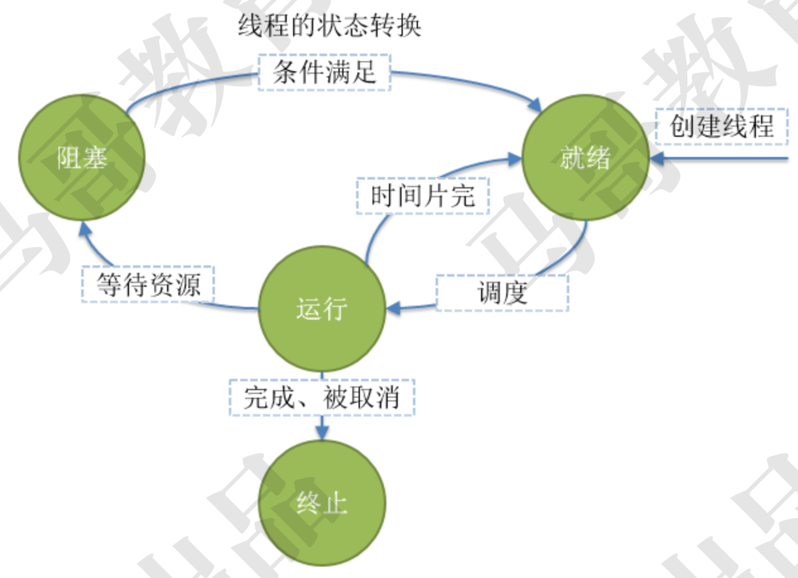

# threading 模块

## 并行与并发
并行是使用水平扩展方式解决并发的一种方式

## 线程状态

|状态|含义|
|:--|:--|
|Ready|就绪，线程能够运行，但在等待被调度。可能线程刚刚启动，或刚刚从阻塞中恢复，或者被其他线程抢占|
|Running|运行，线程正在运行|
|Blocked|阻塞，线程等待外部事件发生而无法运行，如I/O操作|
|Terminated|线程完成，或推出、或被取消|


* 线程的状态转换


**主线程**: 主模块代码执行在主线程中，一个解释器进程至少一个线程，这就是主线程

**工作线程**: 执行具体任务的是工作线程

## 多线程示例代码

```python
import threading
import time

def worker():
    while True:
        time.sleep(1)
        print("I'm working", threading.current_thread().name)


for i in range(2):
    # 创建线程对象
    t = threading.Thread(target=worker, name='worker') # 线程对象，不是线程
    # 启动线程
    t.start()   # 启动线程，系统调用，在OS创建线程
```

## threading 模块的属性和方法
|名称|含义|
|:--|:--|
|current_rhread()|返回当前线程对象|
|main_thread()|返回主线程对象|
|active_count()|当前处于alive状态的线程个数|
|enumerate()|返回所有活着的线程列表，不包括已经终止活着未开始的线程|

## Thread 实例的属性和方法
|名称|含义|
|:--|:--|
|name|标识符，可以重名，getName()，setName() 获取，设置这个标识符|
|ident|线程ID，非0整数，线程启动后才会有ID，否则为None，线程退出，此ID依旧可以访问，此ID可以重复使用|
|is_alive()|返回线程是否还活着|

## GIL
全局解释器锁

#### 串行执行
```python
import threading 
import datetime

import logging

FORMAT = "%(thread)d %(message)s"
logging.basicConfig(format=FORMAT, level=logging.INFO)

start = datetime.datetime.now()
def calc(): # 计算密集型
    sum = 0
    for _ in range(200000000):
        sum += 1
    logging.info('Finished')    # IO

# GIL
# 串行执行，耗时 76.388621s
calc()
calc()
calc()
calc()

delta = (datetime.datetime.now() - start).total_seconds()
logging.info(delta)     # 串行 76.388621s
```

#### 多线程执行
```python
import threading 
import datetime

import logging

FORMAT = "%(thread)d %(message)s"
logging.basicConfig(format=FORMAT, level=logging.INFO)

start = datetime.datetime.now()
def calc(): # 计算密集型
    sum = 0
    for _ in range(200000000):
        sum += 1
    logging.info('Finished')    # IO

# GIL
tasks = []
for i in range(4):
    t = threading.Thread(target=calc, name='calc-{}'.format(i+1))
    tasks.append(t)
    t.start()

for t in tasks:
    t.join()


delta = (datetime.datetime.now() - start).total_seconds()
logging.info(delta)     # 串行 76.388621  
# 多线程 80s 对于CPU密集型代码来说，Python的多线程由于GIL所有没有任何优势
```

#### 多进程
```python
import threading 
import datetime
import multiprocessing

import logging

FORMAT = "%(thread)d %(message)s"
logging.basicConfig(format=FORMAT, level=logging.INFO)

start = datetime.datetime.now()
def calc(): # 计算密集型
    sum = 0
    for _ in range(200000000):
        sum += 1
    logging.info('Finished')    # IO

if __name__ == '__main__':
    # GIL
    tasks = []
    for i in range(4):
        # t = threading.Thread(target=calc, name='calc-{}'.format(i+1))
        t = multiprocessing.Process(target=calc, name='calc-{}'.format(i+1))
        tasks.append(t)
        t.start()

    for t in tasks:
        t.join()


    delta = (datetime.datetime.now() - start).total_seconds()
    logging.info(delta)     # 串行 76.388621  
    # 多线程 80s 对于CPU密集型代码来说，Python的多线程由于GIL所有没有任何优势
    # 多进程 43.542573
```

##### 对比
|运行方式|耗时|
|:--|:--|
|串行|76.388621s|
|多线程|80s|
|多进程|43.542573|


#### 进程池
```python
import threading 
import datetime
import multiprocessing

import logging

FORMAT = "%(thread)d %(message)s"
logging.basicConfig(format=FORMAT, level=logging.INFO)

start = datetime.datetime.now()


def calc(): # 计算密集型
    sum = 0
    for _ in range(200000000):
        sum += 1
    logging.info('Finished')    # IO


if __name__ == '__main__':  # 进程池
    # GIL
    pool = multiprocessing.Pool(4)
    tasks = []
    for i in range(4):
        pool.apply_async(calc) # 异步提交
        # tasks.append(t)
        # t.start()
    
    pool.close()
    pool.join()

    delta = (datetime.datetime.now() - start).total_seconds()
    logging.info(delta)     
    
    # 串行 76.388621  
    # 多线程 80s 对于CPU密集型代码来说，Python的多线程由于GIL所有没有任何优势
    # 多进程 43.542573
```

```python
import threading 
import datetime
import multiprocessing
from concurrent.futures import ThreadPoolExecutor, ProcessPoolExecutor

import logging

FORMAT = "%(thread)d %(message)s"
logging.basicConfig(format=FORMAT, level=logging.INFO)

start = datetime.datetime.now()


def calc(): # 计算密集型
    sum = 0
    for _ in range(200000000):
        sum += 1
    logging.info('Finished')    # IO


if __name__ == '__main__':  # 进程池
    executor = ProcessPoolExecutor(4)
    with executor:
        for i in range(4):
            future = executor.submit(calc)\

    delta = (datetime.datetime.now() - start).total_seconds()
    logging.info(delta)     
    
    # 串行 76.388621  
    # 多线程 80s 对于CPU密集型代码来说，Python的多线程由于GIL所有没有任何优势
    # 多进程 43.542573


```