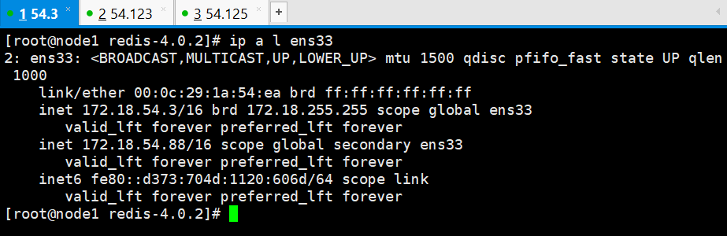
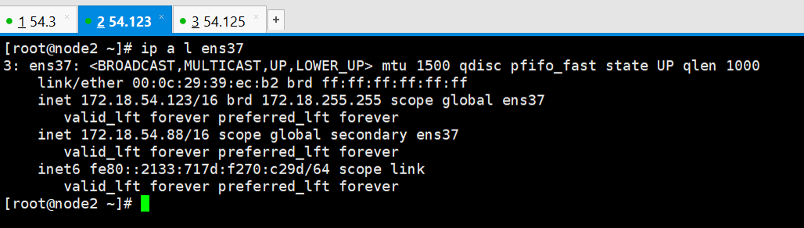

# Redis
#### Redis安装：
1. 下载Redis：
	* wget http://download.redis.io/releases/redis-4.0.2.tar.gz
2. 解压并安装：
	* tar xf redis-4.0.2.tar.gz
	* cd redis-4.0.2
	* make
3. 启动Redis
	* src/redis-server
#### Redis主从复制：

##### 环境：

---

| 主      | 172.18.54.3 |
| :-------| --------:|
| 从    |   172.18.54.123 |
| 从 | 172.18.54.125 |

`所有主机redis均安装在/opt/目录下`

---
##### 配置主从：
##### 主：
1. 编辑master配置文件，修改一下参数：
	配置文件为redis.conf
```
bind 0.0.0.0
#绑定监听地址
protected-mode no
#关闭保护模式，如果不关闭必须设置redis认证密码，否则无法远程连接redis
daemonize yes
#是否为守护模式运行；
logfile "/var/log/redis_6379.log"
#日志文件位置，如果为空，前台运行日志输出到标准输出，后台运行输出到/dev/null
min-slaves-to-write 1
#根据主从数量修改，从节点少于此处指定的值，主节点不可写；
requirepass 123 
#设置redis认证
```
**其他配置保持默认即可；**

2. 启动Redis
`src/redis-server  redis.conf`

---
*默认Redis监听端口：6379*
*可通过`ss -tanl`查看端口是否监听或通过`redis-cli` 去连接redis检测redis运行状态。*

---

##### 从：
1. 编辑配置文件
```
bind 0.0.0.0
#绑定监听地址
protected-mode no
#关闭保护模式，如果不关闭必须设置redis认证密码，否则无法远程连接redis
daemonize yes
#是否为守护模式运行；
logfile "/var/log/redis_6379.log"
#日志文件位置，如果为空，前台运行日志输出到标准输出，后台运行输出到/dev/null
slaveof 172.18.54.3 6379
#指明master的地址及端口
masterauth 123
#指定连接master时的认证密码；
```

2. 启动Redis
` src/redis-cli  redis.conf`

##### 从master上查看主从状态：
```
~]# redis-cli
127.0.0.1:6379> AUTH 123
OK
127.0.0.1:6666> INFO REPLICATION
# Replication
role:master
connected_slaves:2
min_slaves_good_slaves:2
slave0:ip=172.18.54.125,port=6379,state=online,offset=9044235,lag=0
slave1:ip=172.18.54.123,port=6379,state=online,offset=9044094,lag=1
master_replid:1b7f4cf531d6185ef810b61cee9537a150cc064b
master_replid2:0000000000000000000000000000000000000000
master_repl_offset:9044376
second_repl_offset:-1
repl_backlog_active:1
repl_backlog_size:1048576
repl_backlog_first_byte_offset:8972142
repl_backlog_histlen:72235


```

##### 测试主从复制：
1. 在主服务器上设置一个Key
```
~]# redis-cli
172.18.54.3:6379> SET tom 100

```

2. 在各从服务器上测试：
```
~]# redis-cli 
172.18.54.123:6379> GET tom
"100"

```

---

# Redis Sentinel
* Redis-Sentinel是Redis官方推荐的高可用解决方案，它能监控多个Redis集群。当使用sentinel做redis主从进群的高可用方案时，master宕机时，sentinel会自动从集群中的slave中选出一个提升其为新的master，Redis-sentinel是一个单独运行的程序，所以说其并不会受redis宕机的影响。
* 主要功能：
	* 定期监控redis是否按照预期良好运行；
	* 如果发现某个redis节点运行出现状况，能够通知其他进程；
	* 能够自动进行failover；
	
* Sentinel集群：显然，如果只是用单个sentinel进程来监控整个集群，那sentinel也会存在单点问题；因此，sentinel也支持集群。


#### 配置Redis-Sentinel
1. 编辑Sentinel的配置文件：
```
bind 0.0.0.0
#配置sentinel监听地址
port 26379
#配置sentinel监听端口(默认26379)
sentinel monitor mymaster 172.18.54.3 6379 1
#配置需要监控的redis集群信息；
#格式: sentinel monitor <master-name> <ip> <redis-port> <quorum>
#quorum：当网络发生阻塞或暂时性不可达时，可能会发生误判认为master宕机了；而quorum则定义了只有指定数量的sentinel节点认为master宕机了，才能真正认为master不可用了；(sentinel集群中的各个节点也能互相通信，通过gossip协议。)	
sentinel auth-pass 123
#设置master认证密码；
#格式：sentinel auth-pass <master-name> <password>
sentinel down-after-milliseconds mymaster 3000
#sentinel会定期向master发送ping请求，如果在指定时间内master没返回有效回应，那么未收到回应的sentinel就会主观的认为master已经不可用了，这个指令则是指定ping请求的回复超时时间；单位毫秒；
```

** 主从上的sentinel配置相同 **

---

* 启动Sentinel
1. `src/redis-sentinel sentinel.conf`
*使用sentinel命令启动*
2. `src/redis-server sentinel.conf sentnel`
*使用redis-server的sentinel模式启动*

* 连接Sentinel查看集群信息：
```
~]# redis-cli -p 26379
127.0.0.1:26379> INFO Sentinel
# Sentinel
sentinel_masters:1
sentinel_tilt:0
sentinel_running_scripts:0
sentinel_scripts_queue_length:0
sentinel_simulate_failure_flags:0
master0:name=mymaster,status=ok,address=172.18.54.3:6379,slaves=2,sentinels=3

```

#### Sentinel相关命令:
* `sentinel masters`
**查看master相关的配置信息**
* `sentinel slaves <MASTER_NAME>`
**查看指定集群中的slaves相关的配置信息**
* `sentinel failover <MASTER_NAME>`
**手动对指定的redis集群进行failover**
* `sentinel get-master-addr-by-name <MASTER_NAME>`
**获取指定集群的master的ip与端口信息**


#### failover测试：
1. 手动将master关闭模拟master宕机。

    kill `ps aux | awk '/src\/redis-server/{print $2}'`

* 如果监控sentinel的日志可以很直观的看出failover的过程：
```
+new-epoch 21
+vote-for-leader f781a28b7ecf1dafe8af087f38117f2fb697a4fa 21
+sdown master mymaster 172.18.54.3 6379
+odown master mymaster 172.18.54.3 6379 #quorum 1/1
Next failover delay: I will not start a failover before Tue Oct 17 15:21:37 2017+config-update-from sentinel f781a28b7ecf1dafe8af087f38117f2fb697a4fa 172.18.54.123 26379 @ mymaster 172.18.54.3 6379
+switch-master mymaster 172.18.54.3 6379 172.18.54.123 6379
+slave slave 172.18.54.125:6379 172.18.54.125 6379 @ mymaster 172.18.54.123 6379 
+slave slave 172.18.54.3:6379 172.18.54.3 6379 @ mymaster 172.18.54.123 6379
+sdown slave 172.18.54.3:6379 172.18.54.3 6379 @ mymaster 172.18.54.123 6379

```

* 可以清楚的看出master从172.18.54.3转移到172.18.54.123

* 在`172.18.54.123`连接到redis上查看主从信息；
```
~]# redis-cli -h 172.18.54.123 -p 6379
172.18.54.123:6379> INFO REPLICATION
# Replication
role:master
connected_slaves:1
min_slaves_good_slaves:1
slave0:ip=172.18.54.125,port=6379,state=online,offset=14334119,lag=1
master_replid:eab932518dee2cbf9cea60b79fa9de176b29744a
master_replid2:0000000000000000000000000000000000000000
master_repl_offset:14334262
second_repl_offset:-1
repl_backlog_active:1
repl_backlog_size:1048576
repl_backlog_first_byte_offset:13881445
repl_backlog_histlen:452818
172.18.54.123:6379> 

```
**可以看出，master已经成功转移到172.18.54.123上，并且从节点172.18.54.125已经自动改变master为172.18.54.123**

* 此时可以手动启动刚刚停掉的172.18.54.3上的master，可以发现，在几秒后redis会自动连接到新的master(172.18.54.123)成为一台从服务器。

```
~]# redis-cli -h 172.18.54.3 -p 6379
172.18.54.3:6379> INFO REPLICATION
# Replication
role:slave
master_host:172.18.54.123
master_port:6379
master_link_status:up
master_last_io_seconds_ago:1
master_sync_in_progress:0
slave_repl_offset:14694995
slave_priority:100
slave_read_only:1
connected_slaves:0
min_slaves_good_slaves:0
master_replid:eab932518dee2cbf9cea60b79fa9de176b29744a
master_replid2:0000000000000000000000000000000000000000
master_repl_offset:14694995
second_repl_offset:-1
repl_backlog_active:1
repl_backlog_size:1048576
repl_backlog_first_byte_offset:14542988
repl_backlog_histlen:152008
```

####SDOWN和ODOWN
* SDOWN：主观下线，一个sentinel实例单方面认为master不可用；
* ODOWN：客观下线，多个sentinel实例同时认为master不可用；

---
##### Sentinel之间和Slaves之间的自动发现机制：
>虽然sentinel集群中各个sentinel都互相连接彼此来检查对方的可用性以及互相发送消息。但是你不用在任何一个sentinel配置任何其它的sentinel的节点。因为sentinel利用了master的发布/订阅机制去自动发现其它也监控了统一master的sentinel节点。
>
>通过向名为`__sentinel__:hello`的管道中发送消息来实现。
>
>同样，你也不需要在sentinel中配置某个master的所有slave的地址，sentinel会通过询问master来得到这些slave的地址的。
>
>每个sentinel通过向每个master和slave的发布/订阅频道`__sentinel__:hello`每秒发送一次消息，来宣布它的存在。
>每个sentinel也订阅了每个master和slave的频道`__sentinel__:hello`的内容，来发现未知的sentinel，当检测到了新的sentinel，则将其加入到自身维护的master监控列表中。
>每个sentinel发送的消息中也包含了其当前维护的最新的master配置。如果某个sentinel发现
>自己的配置版本低于接收到的配置版本，则会用新的配置更新自己的master配置。
>
>在为一个master添加一个新的sentinel前，sentinel总是检查是否已经有sentinel与新的sentinel的进程号或者是地址是一样的。如果是那样，这个sentinel将会被删除，而把新的sentinel添加上去。
>
---

#### 利用sentinel的通知脚本实现集群vip自动迁移

1. **在sentinel配置文件添加一下选项：**
`sentinel client-reconfig-script mymaster /opt/redis-4.0.2/switch.sh`
*  当发生`failover`时，会启动此处所指定的脚本程序,在启动脚本时sentinel会向该脚本传递指定的参数；分别为：`<master-name> <role> <state> <from-ip> <from-port> <to-ip> <to-port>`*

2. **switch.sh脚本内容：**
```
#!/bin/bash
#
dev=ens33
vip=172.18.54.88
local_ip=172.18.54.3
netmask=16

if [ $6 == $local_ip ];then
  ip addr add ${vip}/${netmask} dev $dev &>/dev/null
  arping -q -c 3 -A $vip -I $dev &>/dev/null
else
    ip addr del ${vip}/${netmask} dev $dev &> /dev/null
fi
```
**解释：通过sentinel向脚本传递的第6个参数`<to-ip>`来判断转移的master ip 是否与本机ip相同，如果相同，则将vip配置到本机的指定的网卡上，并且做免费arp通告，否则，就删除本地主机上的vip(如果本机不存在vip，此命令不会改变主机上的任何配置)**

#### 测试：
1. 查看主节点的ip设定：


2. 模拟redis宕机测试脚本是否正常运作
`redis-cli -p 6379 shutdown`

3. 在转移后的redis master主服务器上查看vip是否转移


!!!>.<!!!
