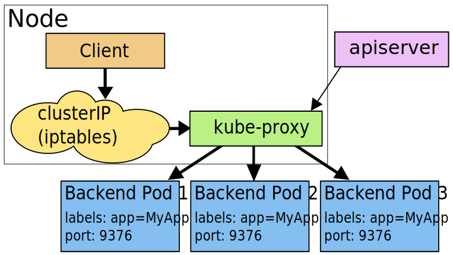

# Service && kube-proxy

## Service
* Kubernetes中的`Pod`是有生命周期的，他们可以被创建，也可以被销毁，然而`Pod`一旦被销毁，就代表着其生命永远结束，在通过`ReplicaSet`能够动态创建和销毁`Pod`（例如：需要进行扩容、滚动升级等）。
* 每个`Pod`在创建时都会拥有自己的IP地址，在`Pod`不断的创建和销毁中，这些IP并不是一直保持不变的，因此会导致一个问题，在Kubernetes集群中，如果一组`Pod`（成为backend）为其他`Pod`（成为frontend）提供服务，那么当这些提供服务的`Pod`发生变化时，frontend如何发现并连接这组`Pod`呢？
* Service是一组Pod的服务抽象，相当于一组Pod的`LB`，负责将请求分发给对应的Pod，通常通过`Label Selector`选择关联的后端`Pod`， Service会为这个`LB`提供一个IP，一般称为`ClusterIP`

## kube-proxy
* `kube-proxy`可以说是`Service`的具体策略的实现，`kube-proxy`会监视kubernetes master对`Service`对象和`Endpoint`的对象添加和移除，对每个`Service`都会设置`iptables`规则，从而捕获到达该`Service`的`ClusterIP`（虚拟IP）和端口的请求，进而将请求重定向到`Service`的一组backend的某个`Pod`上
* 任何到达`Service`的`IP:PORT`的请求，都会被代理到一个合适的backend，不需要客户端知道关于Kubernetes、`Service`或`Pod`的任何信息，如果初始选择的`Pod`没有响应，`iptables`代理能够自动重试另一个`Pod`，不过需要配置`readiness probes`
* `kube-proxy`在v1.0之前只有`userspace`模式，v1.1增加`iptables`模式，v1.2时默认模式从`userspace`改为`iptables`

### userspace：
* 原理图


### iptables：
* 原理图


## Endpoints：
* kubernetes会根据`service`关联到的所有`Pod IP`和`Service`定义的`targetPort`组成一个`endpoints`，若`service`定义中没有`selector`字段，`service`被创建时，`endpoints`不会自动被创建，值为`none`

----------------------------

## 创建Service时指定IP地址：
* 在创建`Service`时，可以通过`spec.clusterIP`来指定自己在集群中的IP地址，要注意，指定的IP地址必须合法，并且在`service-cluster-ip-range` CIDR的范围之内。
	* 指定`clusterIP`
	```
	~]# cat myapp-svc.yaml
	apiVersion: v1
	kind: Service
	metadata:
	  labels:
	    app: myapp-svc
	  name: myapp-svc
	spec:
	  ports:
	  - name: http
	    port: 80
	    targetPort: 80
	  clusterIP: 10.100.100.54
	  selector:
	    app: myapp
	  type: ClusterIP
	```
	* 创建后查看
	```
	~]# kubectl apply -f myapp-svc.yaml
	~]# kubectl get svc
	NAME         TYPE        CLUSTER-IP      EXTERNAL-IP   PORT(S)   AGE
	kubernetes   ClusterIP   10.96.0.1       <none>        443/TCP   5d7h
	myapp-svc    ClusterIP   10.100.100.54   <none>        80/TCP    5m21s
	```


## 服务发现：
* Kubernetes支持两种服务发现形式：
	* 环境变量
		* 当`Pod`运行在`Node`上，`kubelet`会为每个活跃的`Service`添加一组环境变量，简单的 `{SVCNAME}_SERVICE_HOST`和`{SVCNAME}_SERVICE_PORT`变量，这里`Service`的名称需大写，横线被转换成下划线。 它同时支持`Docker links`兼容变量。
	* DNS
		* DNS服务是集群中的可选插件，这个DNS服务通过`Kubernetes API`监视着每个新的`Service`的创建并且在DNS上生成相应的记录，如果在整个集群中启用了DNS服务，那么集群中的所有`Pod`都应该能够自动对`Service`进行名称解析。
		* Kubernetes也支持对端口名称的`DNS SRV（Service）`记录。 如果名称为`"my-service.my-ns"`的`Service`有一个名为`"http"`的`TCP`端口，可以对`"_http._tcp.my-service.my-ns"`执行`DNS SRV`查询，得到`"http"`的端口号。
<!-- 		```
		~]# dig -t srv _http._tcp.myapp.default.svc.cluster.local @10.96.0.10
		; <<>> DiG 9.9.4-RedHat-9.9.4-72.el7 <<>> -t srv _http._tcp.myapp-svc.default.svc.cluster.local @10.96.0.10
		;; global options: +cmd
		;; Got answer:
		;; ->>HEADER<<- opcode: QUERY, status: NOERROR, id: 41367
		;; flags: qr aa rd ra; QUERY: 1, ANSWER: 1, AUTHORITY: 0, ADDITIONAL: 2

		;; OPT PSEUDOSECTION:
		; EDNS: version: 0, flags:; udp: 4096
		;; QUESTION SECTION:
		;_http._tcp.myapp-svc.default.svc.cluster.local.	IN SRV

		;; ANSWER SECTION:
		_http._tcp.myapp-svc.default.svc.cluster.local.	5 IN SRV 0 100 8080 myapp-svc.default.svc.cluster.local.

		;; ADDITIONAL SECTION:
		myapp-svc.default.svc.cluster.local. 5 IN A	10.106.26.196

		;; Query time: 1 msec
		;; SERVER: 10.96.0.10#53(10.96.0.10)
		;; WHEN: Sat Dec 08 23:42:49 EST 2018
		;; MSG SIZE  rcvd: 227
		```
 -->

## Headless Service
> 有时候不需要或者不想要负载均衡，以及单独的`Service IP`，遇到这种情况，可以指定`Cluster IP(spec.clusterIP)`的值为`None`来创建`Headless Service`
> 这个选项允许开发人员自由寻找他们自己的方式，从而降低与Kubernetes系统的耦合性，应用仍然看恶意使用一种自注册的模式和适配器，对其他需要发现机制的系统能够很容易的基于这个API来构建。
> 对`Headless Service`并不会分配`Cluster IP`，`kube-proxy`不会处理他们，而且平台不会为他们进行负载均衡和路由，DNS如何实现自动配置，依赖于`Service`是否定义了`selector`。

* 配置了`Selector`
	* 对定义了`selector`的`Headless Service`， `Endpoint`控制器再`API`中创建了`Endpoints`记录，并且修改DNS配置返回A记录，通过这个地址直接到达`Service`的后端`Pod`上。
	* 定义了`selector`的`Headless Service`，类似于DNS轮训的方式返回所有后端的IP地址
* 没配置`Selector`
	* 对没有定义的`selector`的`Headless Service`，`Endpoint`控制器不会自动创建`Endpoints`记录，因此需要手动将`Service`映射到对应的`endpoints`
	* 可以手动将集群外的服务以`Headless Service`的形式映射到kubernetes集群内、
	```
	# 定义没有selector的headless service
	~]# cat headless-svc.yaml
	apiVersion: v1
	kind: Service
	metadata:
	  labels:
	    app: myapp-svc
	  name: myapp
	spec:
	  type: ClusterIP
	  clusterIP: None
	---
	# 手动创建endpoints
	apiVersion: v1
	kind: Endpoints
	metadata:
	  name: myapp
	subsets:
	- addresses:
	  - ip: 192.168.21.54
	  ports:
	  - name: mysql
	    port: 3306
	```


## Service Types：
* ClusterIP：
	* 使用集群内部IP暴露服务，选择此值服务只能在集群内部访问
* NodePort：
	* 通过`Node`上的IP和静态端口暴露服务，`NodePort`会路由到`ClusterIP`服务，这个`ClusterIP`会自动创建，通过请求`<NodeIP>:<NodePort>`，可以从集群外部访问一个`NodePort`服务。
	* 当`type`字段设置为`NodePort`时，kubernetes master会从`--service-node-port-range`（默认: 30000-32767）定义的端口范围为`Service`分配端口，每个Node将从此端口代理至`Service`（所有Node都是相同的端口）。
* LoadBalancer：
	* 使用云提供商的负载局衡器，可以向外部暴露服务。外部的负载均衡器可以路由到`NodePort`服务和`ClusterIP`服务。
* ExternlName：
	* 通过返回`CNAME`和它的值，可以将服务映射到`externalName`字段的内容（例如，`foo.bar.example.com`）。 没有任何类型代理被创建，这只有`Kubernetes 1.7`或更高版本的`kube-dns`才支持
	```
	# 定义externalName Service
	~]# cat exteranlName.yaml
	apiVersion: v1
	kind: Service
	metadata:
	  name: my-db
	  namespace: default
	spec:
	  type: ExternalName
	  externalName: database.example.com
	# 查看服务
	~]# kubectl get svc
	NAME         TYPE           CLUSTER-IP      EXTERNAL-IP            PORT(S)   AGE
	my-db        ExternalName   <none>          database.example.com   <none>    4m6s
	# 尝试解析
	~]# dig my-db.default.svc.cluster.local @10.96.0.10
	;; ANSWER SECTION:
	my-db.default.svc.cluster.local. 5 IN	CNAME	database.example.com.
	```
