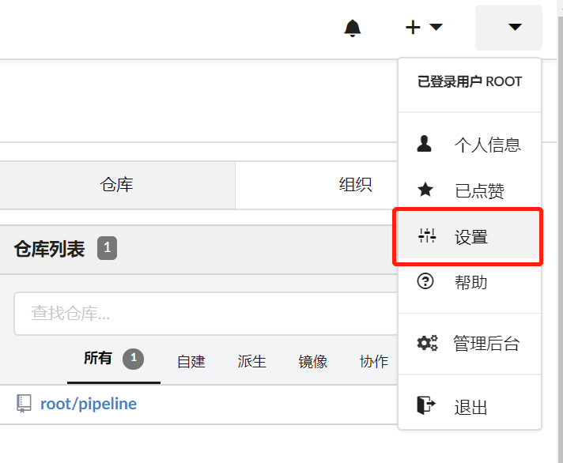
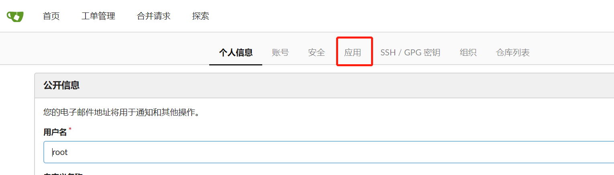
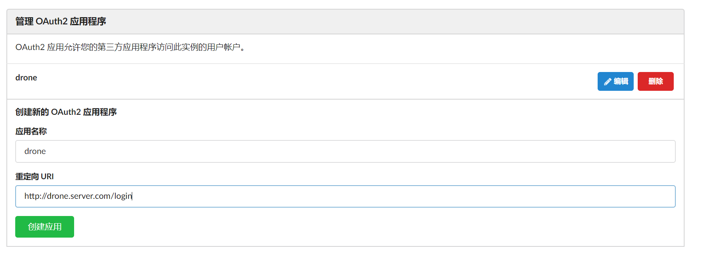
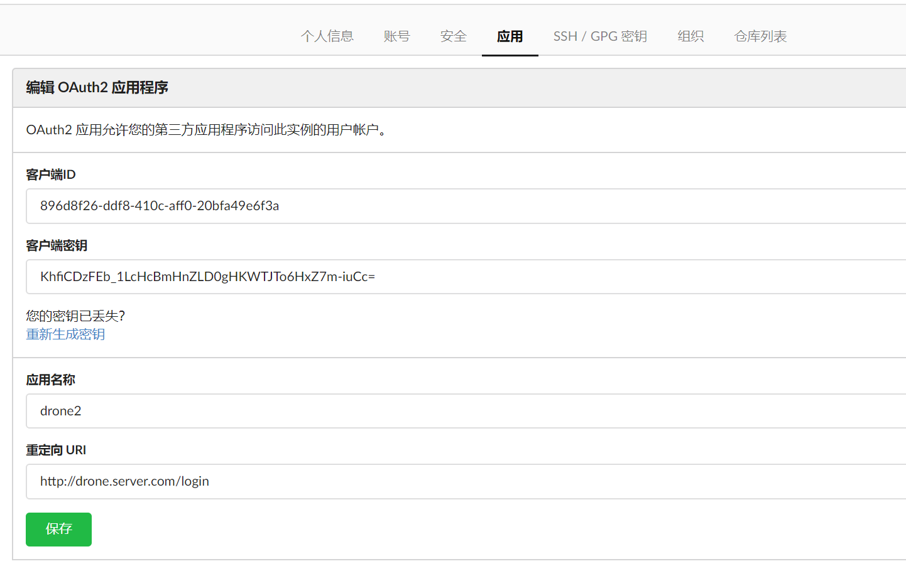

# Drone 
以Docker的方式运行Drone(Kubernetes集成方案尚不成熟，各种问题还有待官方解决)

[Drone介绍](./drone.md)

---
## 目录:
* [安装 Server端](#安装Server)
  * [生成密钥](#生成密钥)
  * [认证配置](#创建OAuth2应用)
  * [配置](#配置)
* [安装 Agent端](#安装Agent)
  * [生成密钥](#生成密钥)
  * [认证配置](#创建OAuth2应用)
  * [配置](#配置)
* [插件使用](#插件)
  * [常用插件列表](#常用插件列表)
  * [docker插件](#docker插件)
  * [DingTalk](#DingTalk插件)
  * [Wechat](#Wechat插件)
  * [Volume Cache](#Volume-Cache插件)

## 安装Server
### 生成密钥
生成密钥用于客户端连接RPC连接使用
```bash
~]# openssl rand -hex 16
b244ea22eee4f53163c0727e46431d50
```

### 创建OAuth2应用
在 `gitea` 上创建 `OAuth2` 应用
1. 


2. 


3. 


注: 这里的重定向 `URL` 要后面的 `/login` 格式为固定，前面的域名可以按照需求自定义

4. 


### 配置
按照上面的得到的值替换相关变量的值

```bash
docker run \
  --volume=/var/lib/drone:/data \
  --env=DRONE_AGENTS_ENABLED=true \
  --env=DRONE_GITEA_SERVER=${GITEA_SERVER_ADDR_OR_Domain} \
  --env=DRONE_GITEA_CLIENT_ID=896d8f26-ddf8-410c-aff0-20bfa49e6f3a \
  --env=DRONE_GITEA_CLIENT_SECRET=KhfiCDzFEb_1LcHcBmHnZLD0gHKWTJTo6HxZ7m-iuCc= \
  --env=DRONE_RPC_SECRET=b244ea22eee4f53163c0727e46431d50 \
  --env=DRONE_SERVER_HOST=${DRONE_SERVER_HOST} \
  --env=DRONE_SERVER_PROTO=http \
  --publish=80:80 \
  --publish=443:443 \
  --restart=always \
  --detach=true \
  --name=drone \
  drone/drone:1

```
注: 以上 `DRONE_GITEA_SERVER` `DRONE_SERVER_HOST` `DRONE_SERVER_PROTO` 等变量的值，根据自身环境来进行替换

## 安装Agent
Drone agent端称为 `Runner`，`Runner` 的种类有3种，分别是
* Docker Runner
* Exec Runner
* SSH Runner
本文主要讲解 `Docker Runner` 的安装与使用

### 配置
安装 `Docker Runner` 非常简单，将官方提供的 `Docker image` 拉取到本地，再将 `Drone Server` 的相关信息以环境变量的方式注入到 `Runner` 中即可

```bash
docker run -d \
  -v /var/run/docker.sock:/var/run/docker.sock \
  -e DRONE_RPC_PROTO=http \
  -e DRONE_RPC_HOST=${DRONE_SERVER_HOST} \
  -e DRONE_RPC_SECRET=b244ea22eee4f53163c0727e46431d50 \
  -e DRONE_RUNNER_CAPACITY=2 \
  -e DRONE_RUNNER_NAME=drone \
  -p 3000:3000 \
  --restart always \
  --name runner \
  drone/agent:1
```
注: 以上 `DRONE_RPC_SECRET` `DRONE_RPC_HOST` `DRONE_RPC_PROTO` 等变量的值，要根据上面 `Drone Server` 的配置信息来替换成相应的值

## 插件
### 常用插件列表


### docker插件


### DingTalk插件


### Wechat插件


### Volume-Cache插件

