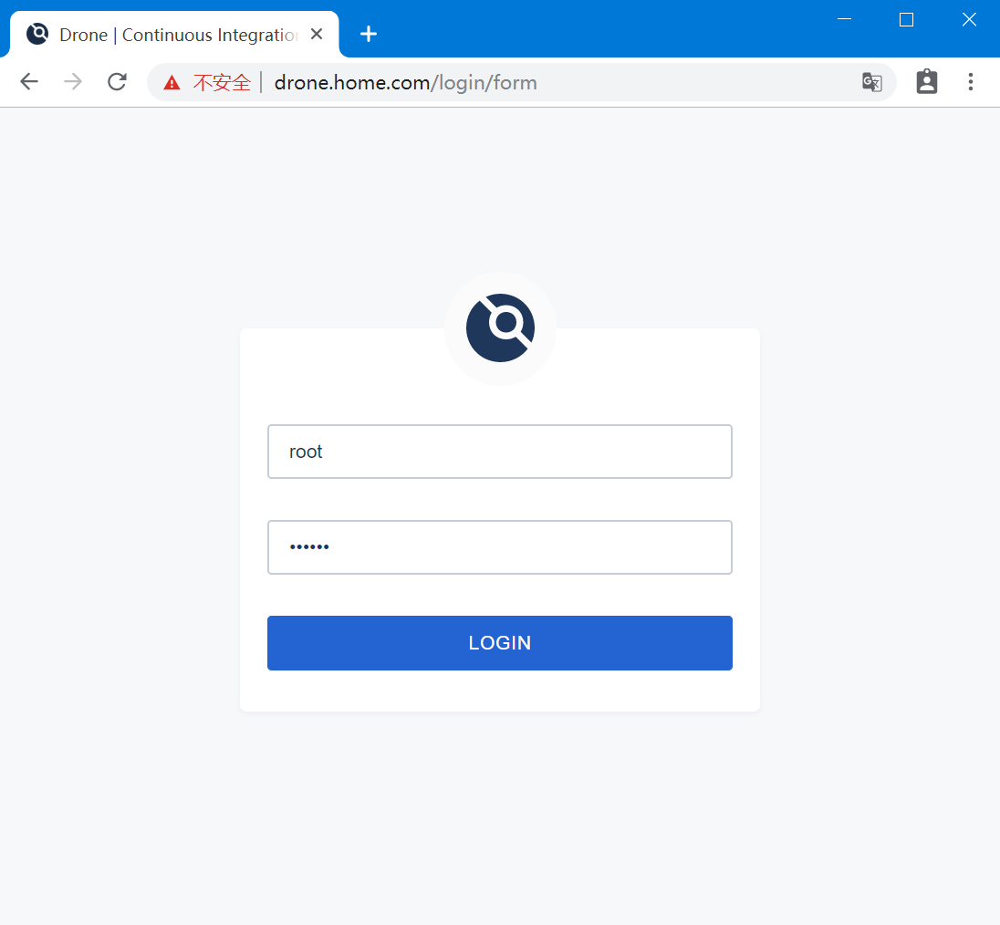
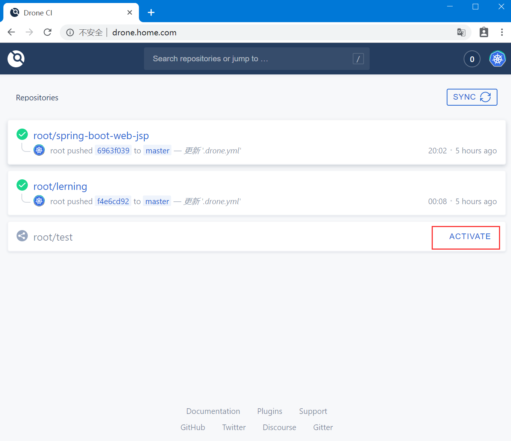
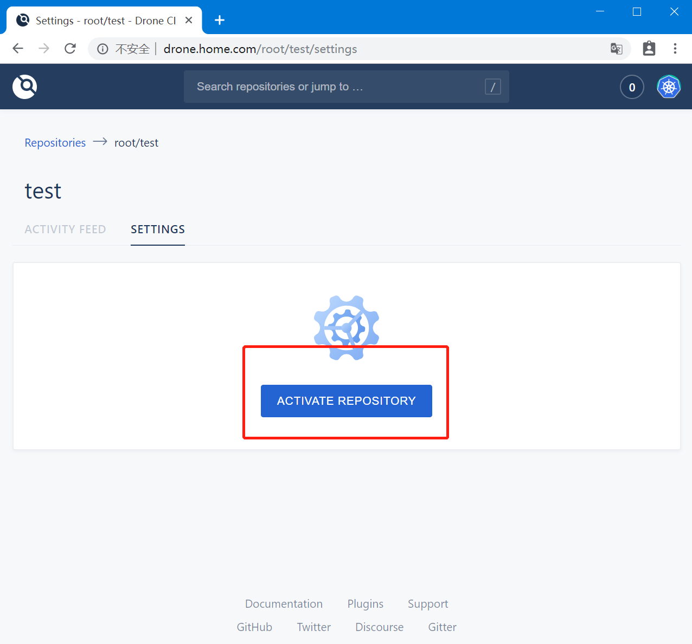
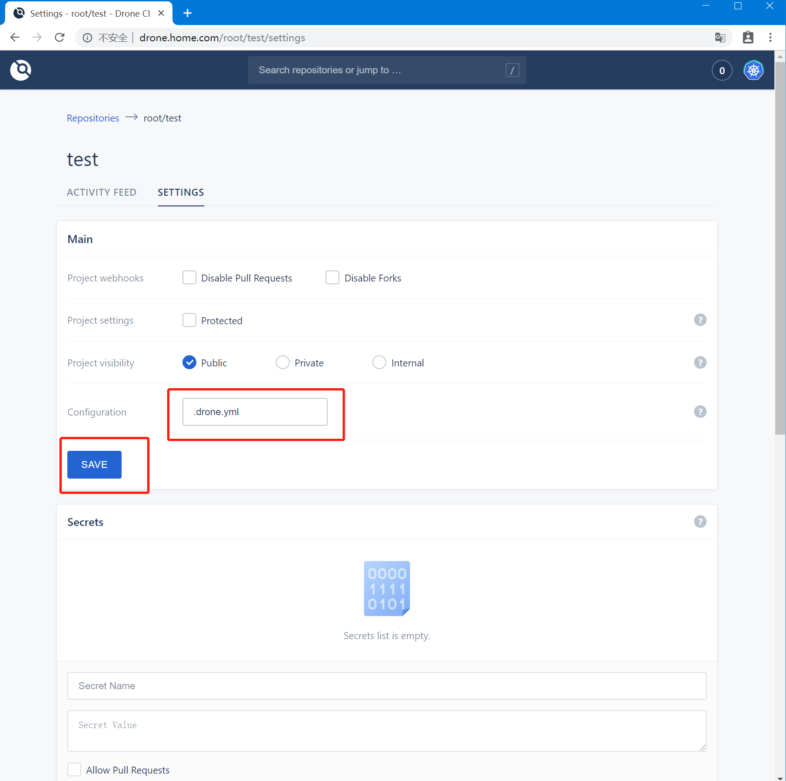
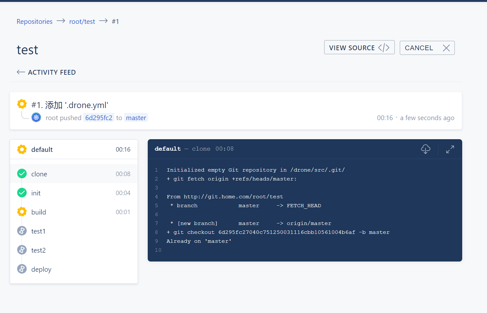

# Drone简单使用
## Overviews
drone 是一个基于 golang 研发的 CI/CD 解决方案，相比于其他方案，比如 jenkins，其好处是更轻量，pipeline 中的每个 step 都是通过启动一个容器来进行，各step之间通过卷挂载来共享数据，可以通过很灵活的为每个 step 指定相应的容器，支持的各种插件也是以容器方式提供

## 认证管理
Drone 自身不负责用户管理，完全依赖外部版本控制系统，通过 token 或者 OAuth2 来进行用户鉴权，目前官方支持的版本管理系统
* GitHub
* Bitbucket Cloud
* Bitbucket Server
* GitLab
* Gitea
* Gogs

## 运行方式
Drone 本身并不负责运行任何构建任务，所有任务都是通过其他容器来运行。

### 在Kubernetes中运行方式
当构建任务被触发后，Drone 会在 Kubernetes 中创建一个 Job，该 Job 会创建一个 Pod，此 Pod 为一个 Drone 的任务控制器，后续的所有的构建任务都由此控制器控制，每次构建时， `drone/controller` 都会创建一个新的名称空间，每个步骤都会创建一个 `pod`，在`Pod` 中运行构建任务或者命令，通过 `volume` 进行数据共享(所有 `pod` 都跑在同一台主机上，跨主机运行数据共享需测试)

## 部署
### yaml 清单文件

* RBAC 规则清单：

```yaml
apiVersion: v1
kind: ServiceAccount
metadata:
  name: drone-pipeline
  namespace: devops
  labels:
    app: drone
---
apiVersion: v1
kind: ServiceAccount
metadata:
  name: drone-pipeline
  namespace: default
  labels:
    app: drone
---
apiVersion: v1
kind: ServiceAccount
metadata:
  name: drone
  namespace: devops
  labels:
    app: drone
---
apiVersion: rbac.authorization.k8s.io/v1
kind: ClusterRole
metadata:
  name: drone-pipeline
  labels:
    app: drone
rules:
  - apiGroups:
      - extensions
    resources:
      - deployments
    verbs:
      - get
      - list
      - watch
      - patch
      - update
  - apiGroups:
      - ""
    resources:
      - namespaces
      - configmaps
      - secrets
      - pods
      - services
    verbs:
      - create
      - delete
      - get
      - list
      - watch
  - apiGroups:
      - ""
    resources:
      - pods/log
    verbs:
      - get
---
apiVersion: rbac.authorization.k8s.io/v1
kind: ClusterRoleBinding
metadata:
  name: drone-pipeline
  labels:
    app: drone
subjects:
  - kind: ServiceAccount
    name: drone-pipeline
    namespace: devops
roleRef:
  kind: ClusterRole
  name: drone-pipeline
  apiGroup: rbac.authorization.k8s.io
---
apiVersion: rbac.authorization.k8s.io/v1
kind: ClusterRoleBinding
metadata:
  name: drone-pipeline
  labels:
    app: drone
subjects:
  - kind: ServiceAccount
    name: drone-pipeline
    namespace: default
roleRef:
  kind: ClusterRole
  name: drone-pipeline
  apiGroup: rbac.authorization.k8s.io
---
apiVersion: rbac.authorization.k8s.io/v1
kind: ClusterRole
metadata:
  name: drone
  labels:
    app: drone
rules:
  - apiGroups:
      - batch
    resources:
      - jobs
    verbs:
      - "*"
  - apiGroups:
      - extensions
    resources:
      - deployments
    verbs:
      - get
      - list
      - patch
      - update
---
apiVersion: rbac.authorization.k8s.io/v1
kind: ClusterRoleBinding
metadata:
  name: drone
  labels:
    app: drone
roleRef:
  apiGroup: rbac.authorization.k8s.io
  kind: ClusterRole
  name: drone
subjects:
- kind: ServiceAccount
  name: drone
  namespace: devops

```

* Deployment清单文件

```yaml
apiVersion: extensions/v1beta1
kind: Deployment
metadata:
  name: drone-server
  namespace: devops
  labels:
    app: drone
    component: server
spec:
  replicas: 1
  template:
    metadata:
      annotations:
      labels:
        app: drone
        component: server
    spec:
      serviceAccountName: drone
      containers:
      - name: server
        image: "drone/drone:1"
        imagePullPolicy: IfNotPresent
        env:
          # 开启debug日志输出
          - name: DRONE_LOGS_DEBUG
            value: "true"
          # 定义k8s镜像拉取策略
          - name: DRONE_KUBERNETES_IMAGE_PULL
            value: "IfNotPresent"

          # 启用Kubernetes
          - name: DRONE_KUBERNETES_ENABLED
            value: "true"
          # 定义job创建的名称空间
          - name: DRONE_KUBERNETES_NAMESPACE
            value: "default"
          # 定义sa账号
          - name: DRONE_KUBERNETES_SERVICE_ACCOUNT
            value: "drone-pipeline"
          - name: DRONE_GIT_ALWAYS_AUTH
            value: "false"
          - name: DRONE_SERVER_HOST
            value: "drone"
          - name: DRONE_RPC_PROTO
            value: "http"
          - name: DRONE_RPC_HOST
            value: "drone.devops:80"
          - name: DRONE_SERVER_PROTO
            value: "http"
          - name: DRONE_RPC_SECRET
            value: "home"
          - name: DRONE_DATABASE_DATASOURCE
            value: "/var/lib/drone/drone.sqlite"
          # 测试使用sqlite3数据库，线上务必使用mysql之类的数据库
          - name: DRONE_DATABASE_DRIVER
            value: "sqlite3"
          - name: DRONE_LOGS_DEBUG
            value: "true"
          #　定义git仓库地址，内网通信
          - name: DRONE_GITEA_SERVER
            value: "http://gitea:3000"
        ports:
        - name: http
          containerPort: 80
          protocol: TCP
        livenessProbe:
          httpGet:
            path: /
            port: http
        volumeMounts:
        - name: datadir
          mountPath: /var/lib/drone
      volumes:
      - name: datadir
        persistentVolumeClaim:
          claimName: drone-data

```

* SVC 创建

```yaml
apiVersion: v1
kind: Service
metadata:
  labels:
    app: drone
  name: drone
  namespace: devops
spec:
  ports:
  - name: http
    port: 80
    protocol: TCP
    targetPort: 80
  selector:
    app: drone
  type: ClusterIP
```

* 使用 `ingress` 导出服务
`使用ingress前请确保已经部署ingress控制器`

```yaml
apiVersion: networking.k8s.io/v1beta1
kind: Ingress
metadata:
  name: drone-ingress
  namespace: devops
spec:
  rules:
  - host: drone.home.com
    http:
      paths:
      - path: /
        backend:
          serviceName: drone
          servicePort: http
```

* 访问：`http://drone.home.com` (绑定host还是解析，视环境自己定)



* 激活仓库
1. 


2.


3.


## 测试
1. 在代码托管仓库根目录下创建 `.drone.yml` 文件
* `.drone.yml`

```yaml
kind: pipeline
name: default

steps:
- name: init
  image: busybox:latest
  commands:
  - pwd

- name: build
  image: busybox:latest
  commands:
  - echo "start Build $(date '+%F %T')"
  - echo "build" >> a

- name: test1
  image: busybox:latest
  commands:
  - echo "test1" >> a
  - cat a
  
- name: test2
  image: busybox:latest
  commands:
  - echo "test2" >> a
  - cat a

- name: deploy
  image: busybox:latest
  commands:
  - echo "deploy" >> a
  - cat a
```

* 查看 CI/CD 是否启动
