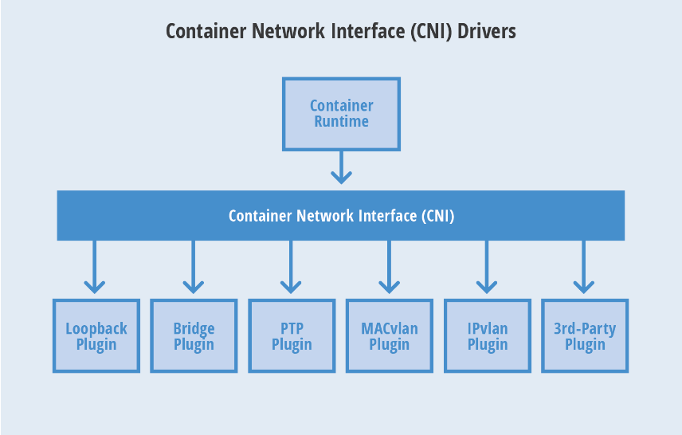

### CNI(Container Network Interface)
> CNI最早是由CoreOS发起的容器网络规范，是Kubernetes网络插件的基础，其基本的思想为：Container Runtime在创建时，先创建好Network Namespace， 然后调用CNI插件为这个Network Namespace配置网络，其后在启动容器内的进程。现已加入CNCF，成为CNCF主推的网络模型。

### Kubernetes Cluster中的网络

* Node Netowrk：承载Kubernetes集群中各个物理节点通信的网络
* Service Network： 由Kubernetes集群中的Services所组成的网络
* Pod Netowrk：Pod网络，承载集群中各个Pod相互通信的网络

#### Pod Netowrk:
* 同一Pod内不同容器之间通信
	* 在同一Pod中，所有容器共享同一个网络名称空间，共享同一个TCP/IP协议栈，各容器之间可以直接使用`localhost`地址直接访问彼此的端口，这和传统的一组服务运行在一台机器上的环境是一致的，所以此种场景下的应用不需要对网络做出特别的修改就可以移植；这种方式简单、安全、高效，也能减少将已存在的应用从物理机或者虚拟机迁移至容器下运行的那那度。

* 同一主机的两个Pod之间通信
	* 

* 不同主机的两个Pod之间通信

### Flannel网络

> Flannel是CoreOS团队针对Kubernetes设计的一个覆盖网络(Overlay Netowrk)，用于帮助kubernetes集群中的每个节点分配一个完整的且与集群其他节点不冲突的子网，使不同主机上的docker容器具有全局唯一的虚拟IP地址

> Flannel实质上是一种`覆盖网络(overlay network)`, 也就是将TCP数据包装载另一种网络包里面金星路由转发和通信，目前已经支持UDP、VxLAN、AWS VPC和GCE路由等数据转发方式。
>默认的节点间数据通信方式是UDP转发。

#### 工作原理：

> Flannel通过etcd服务维护了一张节点间的路由表，里面详细记录了各节点的子网网段，
> 源主机的`Flanneld`服务将原本的数据内容UDP封装后根据`etcd`中维护的路由表投递到目标节点的`flanneld`服务，数据到达后被解包，然后直接进入目标节点的`falnnel0`虚拟网卡，然后被转发到目标主机的`docker0`虚拟网卡，最后由`docker0`路由到达目标容器。

