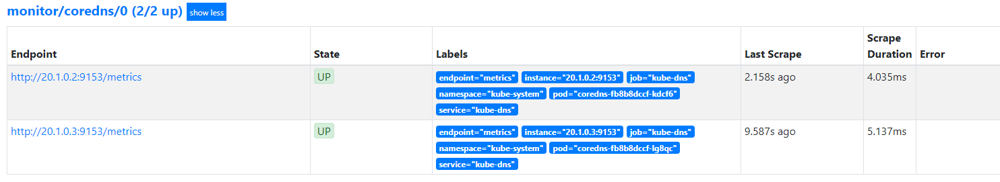
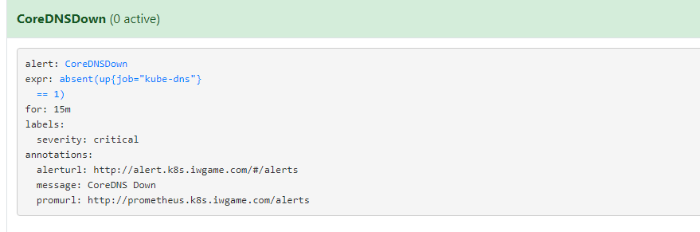
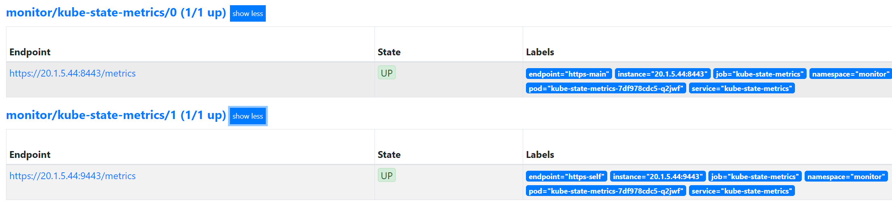

# Prometheus-operator
---
## 目录:
* [介绍](#介绍)
* [架构](#Prometheus-opertor-架构)
* [自定义资源](#Prometheus-operator-自定义资源(CRD))
  * [Prometheus](#Prometheus)
  * [ServiceMonitor](#ServiceMonitor)
  * [PrometheusRule](#PrometheusRule)
  * [Alertmanager](#Alertmanager)
* [部署 Promethue Operator](#部署-Promethue-Operator)
  * [创建名称空间](#创建名称空间)
  * [Operator RBAC权限](#创建Promethue-Operator所需的RBAC权限)
* [部署Operator](#部署Promethue-Operator)
* [部署 Promethues Server](#部署-Promethues-Server)
  * [为Prometheus Server创建RBAC](#RBAC规则创建)
  * [部署](#部署Prometheus)
  * [暴露服务](#使用Ingress将服务导出用于外部访问)
* [定义监控目标](#定义监控目标)
  * [创建ServiceMonitor](#定义监控目标)
* [定义监控规则](#定义监控规则)
* [部署 Alertmanager](#部署-Alertmanager-用于报警发送)
  * [创建sa](#创建sa)
  * [为alertmanager提供配置](#创建alertmanager-secret)
  * [创建Alertmanager](#创建Alertmanager资源)
* [组件安装](#安装-kube-state-metrics-用来导出k8s集群组件的metrics信息)
  * [kube-state-metrics](#kube-state-metrics)
    * [RBAC权限创建](#创建所需要的RBAC规则)
    * [部署kube-state-metrics](#部署kube-state-metrics)
    * [创建svc与svcMonitor](#创建相应的service以及ServiceMonitor)
  * [node-exporter](#node-exporter)
    * [RBAC权限创建](#创建RBAC规则)
    * [部署node-exporter](#创建daemonsets资源)
    * [创建svc与svcMonitor](#创建Service和ServiceMonitor)

## 介绍
`Promethue Operator` 是由 `CoreOS` 团队基于 `Operator ` 框架做的 `Prometheus` 等相关应用程序资源控制器，适用于在 `Kubernetes` 集群中管理 `Promehteus-server` 等相关程序，其实现原理是通过 `kubernetes` 自定义资源API机制来扩展 `kubernetes` 资源， 使用 `CRD(CustomResourceDefinition)` 来创建和管理应用程序

### Operator
> Operator是CoreOS推出的旨在简化复杂有状态应用管理的框架，它是一个感知应用状态的控制器，通过扩展Kubernetes API来自动创建、管理和配置应用实例。
>

## Prometheus-opertor 架构


### Operator：资源控制器
**创建时会生成几个CRD，通过此这些CRD来管理Prometheus Server等相关配置与相关组件**

### Prometheus-operator 自定义资源(CRD)
#### Prometheus
* 描述了 `Promethue Server` 的状态，`Operator` 会为此资源生成一个 `Statefulsets` 资源用来控制 `Promethue Server` 集群的运行状态

#### ServiceMonitor
* 以声明式方式定义要监控的目标，`Operator` 根据 `ServiceMonitor` 定义的目标来自动生成 `Prometheus Server` 的监控目标，并让 `Prometheus Server` 去 `reload` 配置(prometheus有对应的reload的http接口`/-/reload`)，该资源主要通过 `Selector` 拉取匹配特定 `Labels` 的 `Service` 的 `Endpoins` 来进行监控对象的发现。

#### PrometheusRule
* 定义了 `Prometheus Server` 的报警规则与记录规则

#### Alertmanager
* 报警发送组件，也是由 `Operator` 创建的一个 `CRD`，`Operator` 会为此资源生成一个 `Statefulsets` 资源用来控制 `Alertmanager` 集群的运行状态

## 部署 Promethue Operator
* 为了方便管理，将所有资源放在同一个名称空间
####　创建名称空间

```yaml
apiVersion: v1
kind: Namespace
metadata:
  name: monitor
```
```shell
kubectl create -f namespace.yaml
```
#### 创建Promethue Operator所需的RBAC权限

```yaml
apiVersion: rbac.authorization.k8s.io/v1
kind: ClusterRoleBinding
metadata:
  labels:
    app.kubernetes.io/component: controller
    app.kubernetes.io/name: prometheus-operator
    app.kubernetes.io/version: v0.31.1
  name: prometheus-operator
roleRef:
  apiGroup: rbac.authorization.k8s.io
  kind: ClusterRole
  name: prometheus-operator
subjects:
- kind: ServiceAccount
  name: prometheus-operator
  namespace: monitor
---
apiVersion: rbac.authorization.k8s.io/v1
kind: ClusterRole
metadata:
  labels:
    app.kubernetes.io/component: controller
    app.kubernetes.io/name: prometheus-operator
    app.kubernetes.io/version: v0.31.1
  name: prometheus-operator
rules:
- apiGroups:
  - apiextensions.k8s.io
  resources:
  - customresourcedefinitions
  verbs:
  - '*'
- apiGroups:
  - monitoring.coreos.com
  resources:
  - alertmanagers
  - prometheuses
  - prometheuses/finalizers
  - alertmanagers/finalizers
  - servicemonitors
  - podmonitors
  - prometheusrules
  verbs:
  - '*'
- apiGroups:
  - apps
  resources:
  - statefulsets
  verbs:
  - '*'
- apiGroups:
  - ""
  resources:
  - configmaps
  - secrets
  verbs:
  - '*'
- apiGroups:
  - ""
  resources:
  - pods
  verbs:
  - list
  - delete
- apiGroups:
  - ""
  resources:
  - services
  - services/finalizers
  - endpoints
  verbs:
  - get
  - create
  - update
  - delete
- apiGroups:
  - ""
  resources:
  - nodes
  verbs:
  - list
  - watch
- apiGroups:
  - ""
  resources:
  - namespaces
  verbs:
  - get
  - list
  - watch
---
apiVersion: v1
kind: ServiceAccount
metadata:
  labels:
    app.kubernetes.io/component: controller
    app.kubernetes.io/name: prometheus-operator
    app.kubernetes.io/version: v0.31.1
  name: prometheus-operator
  namespace: monitor
---
apiVersion: v1
kind: Service
metadata:
  labels:
    app.kubernetes.io/component: controller
    app.kubernetes.io/name: prometheus-operator
    app.kubernetes.io/version: v0.31.1
    app: prometheus-operator
  name: prometheus-operator
  namespace: monitor
spec:
  clusterIP: None
  ports:
  - name: http
    port: 8080
    targetPort: http
  selector:
    app.kubernetes.io/component: controller
    app.kubernetes.io/name: prometheus-operator
```
```shell
kubectl create -f opertor-rbac.yaml
```

#### 部署Promethue Operator

```yaml
apiVersion: apps/v1
kind: Deployment
metadata:
  labels:
    app.kubernetes.io/component: controller
    app.kubernetes.io/name: prometheus-operator
    app.kubernetes.io/version: v0.31.1
  name: prometheus-operator
  namespace: monitor
spec:
  replicas: 1
  selector:
    matchLabels:
      app.kubernetes.io/component: controller
      app.kubernetes.io/name: prometheus-operator
  template:
    metadata:
      labels:
        app.kubernetes.io/component: controller
        app.kubernetes.io/name: prometheus-operator
        app.kubernetes.io/version: v0.31.1
    spec:
      containers:
      - args:
        - --kubelet-service=kube-system/kubelet
        - --logtostderr=true
        - --config-reloader-image=quay.io/coreos/configmap-reload:v0.0.1
        - --prometheus-config-reloader=quay.io/coreos/prometheus-config-reloader:v0.31.1
        image: quay.io/coreos/prometheus-operator:v0.31.1
        name: prometheus-operator
        ports:
        - containerPort: 8080
          name: http
        resources:
          limits:
            cpu: 200m
            memory: 200Mi
          requests:
            cpu: 100m
            memory: 100Mi
        securityContext:
          allowPrivilegeEscalation: false
      nodeSelector:
        beta.kubernetes.io/os: linux
      securityContext:
        runAsNonRoot: true
        runAsUser: 65534
      serviceAccountName: prometheus-operator
```
```shell
kubectl create -f opertor-deployment.yaml
```

* 成功运行后查看日志会发现 `Operator` 创建的`CRD`

```log
ts=2019-07-01T12:43:45.504631512Z caller=main.go:181 msg="Starting Prometheus Operator version '0.31.1'."
ts=2019-07-01T12:43:45.515321637Z caller=main.go:97 msg="Staring insecure server on :8080"
level=info ts=2019-07-01T12:43:45.59535869Z caller=operator.go:419 component=prometheusoperator msg="connection established" cluster-version=v1.14.2
level=info ts=2019-07-01T12:43:45.601105939Z caller=operator.go:213 component=alertmanageroperator msg="connection established" cluster-version=v1.14.2
level=info ts=2019-07-01T12:43:45.803962364Z caller=operator.go:628 component=alertmanageroperator msg="CRD created" crd=Alertmanager
level=info ts=2019-07-01T12:43:45.813695242Z caller=operator.go:1586 component=prometheusoperator msg="CRD created" crd=Prometheus
level=info ts=2019-07-01T12:43:45.992593954Z caller=operator.go:1586 component=prometheusoperator msg="CRD created" crd=ServiceMonitor
level=info ts=2019-07-01T12:43:46.096948893Z caller=operator.go:1586 component=prometheusoperator msg="CRD created" crd=PodMonitor
level=info ts=2019-07-01T12:43:46.158222101Z caller=operator.go:1586 component=prometheusoperator msg="CRD created" crd=PrometheusRule
level=info ts=2019-07-01T12:43:48.841835612Z caller=operator.go:229 component=alertmanageroperator msg="CRD API endpoints ready"
level=info ts=2019-07-01T12:43:49.042354458Z caller=operator.go:184 component=alertmanageroperator msg="successfully synced all caches"
level=info ts=2019-07-01T12:43:58.288896683Z caller=operator.go:435 component=prometheusoperator msg="CRD API endpoints ready"
level=info ts=2019-07-01T12:43:59.091018639Z caller=operator.go:365 component=prometheusoperator msg="successfully synced all caches"
```

* 也可已通过命令获取

```shell
kubectl get crd
```
```
NAME                                    CREATED AT
alertmanagers.monitoring.coreos.com     2019-07-23T07:03:42Z
podmonitors.monitoring.coreos.com       2019-07-23T07:03:43Z
prometheuses.monitoring.coreos.com      2019-07-23T07:03:46Z
prometheusrules.monitoring.coreos.com   2019-07-23T07:03:47Z
servicemonitors.monitoring.coreos.com   2019-07-23T07:03:48Z
```

## 部署 Promethues Server
#### RBAC规则创建

```yaml
apiVersion: v1
kind: ServiceAccount
metadata:
  name: prometheus
  namespace: monitor
---
apiVersion: rbac.authorization.k8s.io/v1beta1
kind: ClusterRole
metadata:
  name: prometheus
rules:
- apiGroups: [""]
  resources:
  - nodes
  - nodes/metrics
  - services
  - endpoints
  - pods
  verbs: ["get", "list", "watch"]
- apiGroups: [""]
  resources:
  - configmaps
  verbs: ["get"]
- nonResourceURLs: ["/metrics"]
  verbs: ["get"]
---
apiVersion: rbac.authorization.k8s.io/v1beta1
kind: ClusterRoleBinding
metadata:
  name: prometheus
roleRef:
  apiGroup: rbac.authorization.k8s.io
  kind: ClusterRole
  name: prometheus
subjects:
- kind: ServiceAccount
  name: prometheus
  namespace: monitor
```
```shell
kubectl create -f prometheus-rbac.yaml
```

#### 部署Prometheus

```yaml
apiVersion: monitoring.coreos.com/v1
kind: Prometheus
metadata:
  # 这里的name为Promethues创建时的后缀名，前缀固定为 prometheus
  name: test
  namespace: monitor
  labels:
    prometheus: prometheus
spec:
  replicas: 3
  # 镜像地址，省略则为默认地址
  baseImage: quay.io/prometheus/prometheus
  version: v2.10.0
  serviceAccountName: prometheus
  # 关联哪些的名称空间的servicemonitor，{} 为所有名称空间
  serviceMonitorNamespaceSelector: {}
  # servicemonitor关联那些名称空间的svc，{}为所有名称空间
  serviceMonitorSelector: {}
  # Alertmanager 配置
  alerting:
    alertmanagers:
    - namespace: monitor
      name: alertmanager-svc
      port: web
  # 资源要求
  resources:
    requests:
      memory: 400Mi
# Rules Selector
  ruleSelector:
    matchLabels:
      # 这里的Lables 要与 Prometheusrule定义的labels匹配，不然无法加载
      prometheus: test
      role: alert-rules
# 持久存储
  storage:
    volumeClaimTemplate:
      spec:
        storageClassName: managed-nfs-storage
        resources:
          requests:
            storage: 50Gi
```
```shell
kubectl create -f prometheus-deployment.yaml
```

#### 使用Ingress将服务导出用于外部访问

```yaml
apiVersion: networking.k8s.io/v1beta1
kind: Ingress
metadata:
  name: prometheus-ingress
  annotations:
    kubernetes.io/ingress.class: "nginx"
  namespace: monitor
spec:
  rules:
  - host: prometheus.k8s.com
    http:
      paths:
      - path: /
        backend:
          # prometheus-operated 此svc会在创建prometheus时自动由operator生成
          serviceName: prometheus-operated
          servicePort: web
```
```shell
kubectl create -f prometheus-ingress.yaml
```

* 访问 `http://prometheus.k8s.com`
* 外部访问需要域名解析，或者手动绑定host访问，这里使用的Ingress导出，其他方式、如NodePort方式，这里不做演示

### 定义监控目标
* 监控目标是通过 `ServiceMonitor` 来定义的
* 监控`CoreDNS`

```yaml
apiVersion: monitoring.coreos.com/v1
kind: ServiceMonitor
metadata:
  labels:
    k8s-app: coredns
  name: coredns
  namespace: monitor
spec:
  endpoints:
  - bearerTokenFile: /var/run/secrets/kubernetes.io/serviceaccount/token
    interval: 15s
    port: metrics
  jobLabel: k8s-app
  namespaceSelector:
    matchNames:
    - kube-system
  selector:
    matchLabels:
      # ServiceMonitor通过标签选择相应的SVC，请确保相应的要发现的SVC存在定义的标签
      k8s-app: kube-dns
```
```bash
kubectl create -f servicemonitor.yaml
```

* 此时通过`http://prometheus.k8s.com/targets`即可看到所有的`coredns`实例



* 由`Promehteus`中的`Endpoins`显示可以看出，`Promethue`通过 `ServiceMonitor`来动态发现要监控的target，后续的指标采集直接通过`Pod`的`IP`与`metrics`接口来获取，不通过`Service`去请求，`Service`只是辅助`Promethue`来做目标发现的

### 定义监控规则
* `Promethue`的监控规则通过`PromethueRule`来创建，`Promethue`会自动从`PromethueRule`中加载规则
* 定义`PromethueRule`

```yaml
apiVersion: monitoring.coreos.com/v1
kind: PrometheusRule
metadata:
  labels:
    # 这里的labels必须与prometheus定义的保持一致
    prometheus: test
    role: alert-rules
  name: prometheus-k8s-rules
  namespace: monitor
spec:
  groups:
  # 组名，可以将同类别的监控项放到同一个组内
  - name: InstanceDown
    rules:
    - alert: CoreDNSDown  # 监控名称，报警是会传给alertmanager
      annotations:
        # 注解，在报警触发时也会传给alertmanager
        message: CoreDNS Down
        alerturl: http://alert.k8s.com/#/alerts
        promurl: http://prometheus.k8s.com/alerts
      # 报警表达式，PromQL格式的表达式
      expr: |
        absent(up{job="kube-dns"} == 1)
      # 持续多长时间发送报警
      for: 15m
      # 定义labels，会传给alertmanager，自定义报警信息时可以用到
      labels:
        severity: critical
```
```shell
kubectl create -f PromethueRule.yaml
```

* 此时通过`http://prometheus.k8s.com/alerts`即可看到所有的刚刚定义的监控规则



## 部署 Alertmanager 用于报警发送
#### Alertmanager 的部署通过定义 Alertmanager资源来创建
#### 创建sa

```yaml
apiVersion: v1
kind: ServiceAccount
metadata:
  name: alertmanager-sa
  namespace: monitor
```
```shell
kubectl create -f alertmanager-sa.yaml
```

#### 创建alertmanager-secret
* Alertmanager 启动前需要为其提供一份配置文件，此配置文件在k8s集群中以`Secrets`形式提供
* 创建alertmanager配置文件
* 明文

```yaml
"global":
  "resolve_timeout": "5m"
  # 邮件通知发件人
  "smtp_from": "user@domain.com"
  # smtp邮件服务器
  "smtp_smarthost": "mail.domain.com:25"
  # smtp认证用户名
  "smtp_auth_username": "user@domain.com"
  # smtp 认证密码
  "smtp_auth_password": "1122334455"
  # 是否开启tls通信
  "smtp_require_tls": true
# 接收器列表
"receivers":
# 接收器名称
- "name": "default_email"
  # 邮件配置
  "email_configs":
  # 收件人
  - "to": "user@domain.com"
    # 恢复是否发送通知
    "send_resolved": true
    # tls配置，私有邮箱服务器可能需要
    "tls_config":
      "insecure_skip_verify": true
# 其他接收器
- "name": "wechat"
  # 企业微信配置
  "wechat_configs":
  - "api_secret": "xxxx"
    "corp_id": "xxxx"
    "agent_id": "1000001"
    "to_user": "@all"
    "to_party": "@all"
    "to_tag": "@all"
# 报警路由
"route":
  # 报警分组，根据指定标签
  "group_by":
  - "cluster"
  - "alertname"
  # 组重复出发时间
  "group_interval": "1m"
  # 发送等待
  "group_wait": "30s"
  # 指定报警接收器
  "receiver": "wechat"
  # 重复触发时间间隔，覆盖全局
  "repeat_interval": "12h"
# 报警模板文件
"templates":
  - "*.tmpl"
```

* 将以上内容用`base64`加密后创建`Secrets`

```bash
cat alertmanager-cfg.txt | base64 -w 0
```

```yaml
apiVersion: v1
data:
  alertmanager.yaml: Imdsb2JhbCI6CiAgInJlc29sdmVfdGltZW91dCI6ICI1bSIKICAjIOmCruS7tumAmuefpeWPkeS7tuS6ugogICJzbXRwX2Zyb20iOiAidXNlckBkb21haW4uY29tIgogICMgc210cOmCruS7tuacjeWKoeWZqAogICJzbXRwX3NtYXJ0aG9zdCI6ICJtYWlsLmRvbWFpbi5jb206MjUiCiAgIyBzbXRw6K6k6K+B55So5oi35ZCNCiAgInNtdHBfYXV0aF91c2VybmFtZSI6ICJ1c2VyQGRvbWFpbi5jb20iCiAgIyBzbXRwIOiupOivgeWvhueggQogICJzbXRwX2F1dGhfcGFzc3dvcmQiOiAiMTEyMjMzNDQ1NSIKICAjIOaYr+WQpuW8gOWQr3Rsc+mAmuS/oQogICJzbXRwX3JlcXVpcmVfdGxzIjogdHJ1ZQojIOaOpeaUtuWZqOWIl+ihqAoicmVjZWl2ZXJzIjoKIyDmjqXmlLblmajlkI3np7AKLSAibmFtZSI6ICJkZWZhdWx0X2VtYWlsIgogICMg6YKu5Lu26YWN572uCiAgImVtYWlsX2NvbmZpZ3MiOgogICMg5pS25Lu25Lq6CiAgLSAidG8iOiAidXNlckBkb21haW4uY29tIgogICAgIyDmgaLlpI3mmK/lkKblj5HpgIHpgJrnn6UKICAgICJzZW5kX3Jlc29sdmVkIjogdHJ1ZQogICAgIyB0bHPphY3nva7vvIznp4HmnInpgq7nrrHmnI3liqHlmajlj6/og73pnIDopoEKICAgICJ0bHNfY29uZmlnIjoKICAgICAgImluc2VjdXJlX3NraXBfdmVyaWZ5IjogdHJ1ZQojIOWFtuS7luaOpeaUtuWZqAotICJuYW1lIjogIndlY2hhdCIKICAjIOS8geS4muW+ruS/oemFjee9rgogICJ3ZWNoYXRfY29uZmlncyI6CiAgLSAiYXBpX3NlY3JldCI6ICJ4eHh4IgogICAgImNvcnBfaWQiOiAieHh4eCIKICAgICJhZ2VudF9pZCI6ICIxMDAwMDAxIgogICAgInRvX3VzZXIiOiAiQGFsbCIKICAgICJ0b19wYXJ0eSI6ICJAYWxsIgogICAgInRvX3RhZyI6ICJAYWxsIgojIOaKpeitpui3r+eUsQoicm91dGUiOgogICMg5oql6K2m5YiG57uE77yM5qC55o2u5oyH5a6a5qCH562+CiAgImdyb3VwX2J5IjoKICAtICJjbHVzdGVyIgogIC0gImFsZXJ0bmFtZSIKICAjIOe7hOmHjeWkjeWHuuWPkeaXtumXtAogICJncm91cF9pbnRlcnZhbCI6ICIxbSIKICAjIOWPkemAgeetieW+hQogICJncm91cF93YWl0IjogIjMwcyIKICAjIOaMh+WumuaKpeitpuaOpeaUtuWZqAogICJyZWNlaXZlciI6ICJ3ZWNoYXQiCiAgIyDph43lpI3op6blj5Hml7bpl7Tpl7TpmpTvvIzopobnm5blhajlsYAKICAicmVwZWF0X2ludGVydmFsIjogIjEyaCIKIyDmiqXorabmqKHmnb/mlofku7YKInRlbXBsYXRlcyI6CiAgLSAiKi50bXBsIgo=
kind: Secret
metadata:
  # 此处的name要注意，前缀固定，后缀要与后面定义的alertmanager的name字段保持一致，中间使用"-"连接
  name: alertmanager-test
  namespace: monitor
type: Opaque
```

```bash
kubectl create -f alertmanager-secret.yaml
```

#### 创建Alertmanager资源

```yaml
apiVersion: monitoring.coreos.com/v1
kind: Alertmanager
metadata:
  # 此处的name必须要与刚刚定义的alertmanager secrets定义的后缀一致
  name: test
  namespace: monitor
  labels:
    alertmanager: test
spec:
  replicas: 3
  baseImage: quay.io/prometheus/alertmanager
  nodeSelector:
    beta.kubernetes.io/os: linux
  replicas: 3
  securityContext:
    fsGroup: 2000
    runAsNonRoot: true
    runAsUser: 1000
  serviceAccountName: alertmanager-sa
  version: v0.17.0
# 持久存储配置
  storage:
    volumeClaimTemplate:
      spec:
        storageClassName: managed-nfs-storage
        resources:
          requests:
            storage: 10Gi
```
**至此一个基本的监控框架就搭建完成，后续的步骤主要是一些常见组件的监控指标的导出，以及在Prometheus上配置自定义监控与Grafana的配置**

## 安装 kube-state-metrics 用来导出k8s集群组件的metrics信息
### kube-state-metrics
> kube-state-metrics是一个简单的服务，它监听Kubernetes API服务器并生成有关对象状态的指标,它不关注单个Kubernetes组件的运行状况，而是关注内部各种对象的运行状况，例如`Deployment`，`node`和 `containers`
> kube-state-metrics在 Kubernetes API中公开未修改的原始数据.
> 集群度量指标通`HTTP`协议(端口默认80)的`/metrics`接口提供

#### 创建所需要的RBAC规则

```yaml
apiVersion: rbac.authorization.k8s.io/v1
# kubernetes versions before 1.8.0 should use rbac.authorization.k8s.io/v1beta1
kind: ClusterRoleBinding
metadata:
  name: kube-state-metrics
roleRef:
  apiGroup: rbac.authorization.k8s.io
  kind: ClusterRole
  name: kube-state-metrics
subjects:
- kind: ServiceAccount
  name: kube-state-metrics
  namespace: monitor
---
apiVersion: rbac.authorization.k8s.io/v1
# kubernetes versions before 1.8.0 should use rbac.authorization.k8s.io/v1beta1
kind: ClusterRole
metadata:
  name: kube-state-metrics
rules:
- apiGroups: [""]
  resources:
  - configmaps
  - secrets
  - nodes
  - pods
  - services
  - resourcequotas
  - replicationcontrollers
  - limitranges
  - persistentvolumeclaims
  - persistentvolumes
  - namespaces
  - endpoints
  verbs: ["list", "watch"]
- apiGroups: ["extensions"]
  resources:
  - daemonsets
  - deployments
  - replicasets
  - ingresses
  verbs: ["list", "watch"]
- apiGroups: ["apps"]
  resources:
  - daemonsets
  - deployments
  - replicasets
  - statefulsets
  verbs: ["list", "watch"]
- apiGroups: ["batch"]
  resources:
  - cronjobs
  - jobs
  verbs: ["list", "watch"]
- apiGroups: ["autoscaling"]
  resources:
  - horizontalpodautoscalers
  verbs: ["list", "watch"]
- apiGroups: ["policy"]
  resources:
  - poddisruptionbudgets
  verbs: ["list", "watch"]
- apiGroups: ["certificates.k8s.io"]
  resources:
  - certificatesigningrequests
  verbs: ["list", "watch"]
- apiGroups: ["storage.k8s.io"]
  resources:
  - storageclasses
  verbs: ["list", "watch"]
- apiGroups: ["autoscaling.k8s.io"]
  resources:
  - verticalpodautoscalers
  verbs: ["list", "watch"]
- apiGroups: ["authorization.k8s.io"]
  resources:
  - subjectaccessreviews
  verbs: ["create"]
- apiGroups: ["authentication.k8s.io"]
  resources:
  - tokenreviews
  verbs: ["create"]
---
apiVersion: rbac.authorization.k8s.io/v1
kind: RoleBinding
metadata:
  name: kube-state-metrics
  namespace: monitor
roleRef:
  apiGroup: rbac.authorization.k8s.io
  kind: Role
  name: kube-state-metrics
subjects:
- kind: ServiceAccount
  name: kube-state-metrics
  namespace: monitor
---
apiVersion: rbac.authorization.k8s.io/v1
kind: Role
metadata:
  name: kube-state-metrics
  namespace: monitor
rules:
- apiGroups:
  - ""
  resources:
  - pods
  verbs:
  - get
- apiGroups:
  - extensions
  resourceNames:
  - kube-state-metrics
  resources:
  - deployments
  verbs:
  - get
  - update
- apiGroups:
  - apps
  resourceNames:
  - kube-state-metrics
  resources:
  - deployments
  verbs:
  - get
  - update
---
apiVersion: v1
kind: ServiceAccount
metadata:
  name: kube-state-metrics
  namespace: monitor
```
```bash
kubectl create -f kube-state-metrics-rbac.yaml
```

#### 部署kube-state-metrics
```yaml
apiVersion: apps/v1
kind: Deployment
metadata:
  labels:
    app: kube-state-metrics
  name: kube-state-metrics
  namespace: monitor
spec:
  replicas: 1
  selector:
    matchLabels:
      app: kube-state-metrics
  template:
    metadata:
      labels:
        app: kube-state-metrics
    spec:
      containers:
      - args:
        - --logtostderr
        - --secure-listen-address=:8443
        - --tls-cipher-suites=TLS_ECDHE_RSA_WITH_AES_128_GCM_SHA256,TLS_ECDHE_ECDSA_WITH_AES_128_GCM_SHA256,TLS_RSA_WITH_AES_128_CBC_SHA256,TLS_ECDHE_ECDSA_WITH_AES_128_CBC_SHA256,TLS_ECDHE_RSA_WITH_AES_128_CBC_SHA256
        - --upstream=http://127.0.0.1:8081/
        image: quay.io/coreos/kube-rbac-proxy:v0.4.1
        name: kube-rbac-proxy-main
        ports:
        - containerPort: 8443
          name: https-main
        resources:
          limits:
            cpu: 20m
            memory: 40Mi
          requests:
            cpu: 10m
            memory: 20Mi
      - args:
        - --logtostderr
        - --secure-listen-address=:9443
        - --tls-cipher-suites=TLS_ECDHE_RSA_WITH_AES_128_GCM_SHA256,TLS_ECDHE_ECDSA_WITH_AES_128_GCM_SHA256,TLS_RSA_WITH_AES_128_CBC_SHA256,TLS_ECDHE_ECDSA_WITH_AES_128_CBC_SHA256,TLS_ECDHE_RSA_WITH_AES_128_CBC_SHA256
        - --upstream=http://127.0.0.1:8082/
        image: quay.io/coreos/kube-rbac-proxy:v0.4.1
        name: kube-rbac-proxy-self
        ports:
        - containerPort: 9443
          name: https-self
        resources:
          limits:
            cpu: 20m
            memory: 40Mi
          requests:
            cpu: 10m
            memory: 20Mi
      - args:
        - --host=127.0.0.1
        - --port=8081
        - --telemetry-host=127.0.0.1
        - --telemetry-port=8082
        image: quay.io/coreos/kube-state-metrics:v1.6.0
        name: kube-state-metrics
        resources:
          limits:
            cpu: 100m
            memory: 150Mi
          requests:
            cpu: 100m
            memory: 150Mi
      - command:
        - /pod_nanny
        - --container=kube-state-metrics
        - --cpu=100m
        - --extra-cpu=2m
        - --memory=150Mi
        - --extra-memory=30Mi
        - --threshold=5
        - --deployment=kube-state-metrics
        env:
        - name: MY_POD_NAME
          valueFrom:
            fieldRef:
              apiVersion: v1
              fieldPath: metadata.name
        - name: MY_POD_NAMESPACE
          valueFrom:
            fieldRef:
              apiVersion: v1
              fieldPath: metadata.namespace
        image: k8s.gcr.io/addon-resizer:1.8.4
        name: addon-resizer
        resources:
          limits:
            cpu: 50m
            memory: 30Mi
          requests:
            cpu: 10m
            memory: 30Mi
      nodeSelector:
        beta.kubernetes.io/os: linux
      securityContext:
        runAsNonRoot: true
        runAsUser: 65534
      serviceAccountName: kube-state-metrics
```
```bash
kubectl create -f kube-state-metrics-deployment.yaml
```

#### 创建相应的service以及ServiceMonitor
* Service

```yaml
apiVersion: v1
kind: Service
metadata:
  labels:
    k8s-app: kube-state-metrics
  name: kube-state-metrics
  namespace: monitor
spec:
  clusterIP: None
  ports:
  - name: https-main
    port: 8443
    targetPort: https-main
  - name: https-self
    port: 9443
    targetPort: https-self
  selector:
    app: kube-state-metrics
```
```bash
kubectl create -f kube-state-metrics-svc.yaml
```
* ServiceMonitor

```yaml
# kube-state-metrics
apiVersion: monitoring.coreos.com/v1
kind: ServiceMonitor
metadata:
  labels:
    k8s-app: kube-state-metrics
  name: kube-state-metrics
  namespace: monitor
spec:
  endpoints:
  - bearerTokenFile: /var/run/secrets/kubernetes.io/serviceaccount/token
    honorLabels: true
    interval: 30s
    port: https-main
    scheme: https
    scrapeTimeout: 30s
    tlsConfig:
      insecureSkipVerify: true
  - bearerTokenFile: /var/run/secrets/kubernetes.io/serviceaccount/token
    interval: 30s
    port: https-self
    scheme: https
    tlsConfig:
      insecureSkipVerify: true
  jobLabel: k8s-app
  selector:
    matchLabels:
      k8s-app: kube-state-metrics
```
```bash
kubectl create -f kube-state-metrics-svcMonitor.yaml
```
* 此时通过`http://prometheus.k8s.com/targets`即可看到所有的新创建的`kube-state-metrics`目标



### node-exporter
> 在Prometheus的架构设计中，Prometheus Server并不直接服务监控特定的目标，其主要任务负责数据的收集，存储并且对外提供数据查询支持。因此为了能够能够监控到某些东西，如主机的CPU使用率，我们需要使用到Exporter。Prometheus周期性的从Exporter暴露的HTTP服务地址（通常是/metrics）拉取监控样本数据。
> node-exporter能够采集主机上的运行指标，例如磁盘、内存、CPU等信息，并通过HTTP接口将这些信息输出为Prometheus可以理解的格式供prometheus查询

#### 创建RBAC规则

```yaml
apiVersion: rbac.authorization.k8s.io/v1
kind: ClusterRole
metadata:
  name: node-exporter
rules:
- apiGroups:
  - authentication.k8s.io
  resources:
  - tokenreviews
  verbs:
  - create
- apiGroups:
  - authorization.k8s.io
  resources:
  - subjectaccessreviews
  verbs:
  - create
---
apiVersion: rbac.authorization.k8s.io/v1
kind: ClusterRoleBinding
metadata:
  name: node-exporter
roleRef:
  apiGroup: rbac.authorization.k8s.io
  kind: ClusterRole
  name: node-exporter
subjects:
- kind: ServiceAccount
  name: node-exporter
  namespace: monitor
---
apiVersion: v1
kind: ServiceAccount
metadata:
  name: node-exporter
  namespace: monitor
```
```bash
kubectl create -f node-exporter-rbac.yaml
```

#### 创建daemonsets资源
**因为要监控每个主机的资源信息，所有创建为Daemonsets以便跑在每台机器上收集**
```yaml
apiVersion: apps/v1
kind: DaemonSet
metadata:
  labels:
    app: node-exporter
  name: node-exporter
  namespace: monitor
spec:
  selector:
    matchLabels:
      app: node-exporter
  template:
    metadata:
      labels:
        app: node-exporter
    spec:
      containers:
      - args:
        - --web.listen-address=127.0.0.1:9100
        - --path.procfs=/host/proc
        - --path.sysfs=/host/sys
        - --path.rootfs=/host/root
        - --collector.filesystem.ignored-mount-points=^/(dev|proc|sys|var/lib/docker/.+)($|/)
        - --collector.filesystem.ignored-fs-types=^(autofs|binfmt_misc|cgroup|configfs|debugfs|devpts|devtmpfs|fusectl|hugetlbfs|mqueue|overlay|proc|procfs|pstore|rpc_pipefs|securityfs|sysfs|tracefs)$
        image: quay.io/prometheus/node-exporter:v0.18.1
        name: node-exporter
        resources:
          limits:
            cpu: 250m
            memory: 180Mi
          requests:
            cpu: 102m
            memory: 180Mi
        volumeMounts:
        - mountPath: /host/proc
          name: proc
          readOnly: false
        - mountPath: /host/sys
          name: sys
          readOnly: false
        - mountPath: /host/root
          mountPropagation: HostToContainer
          name: root
          readOnly: true
      - args:
        - --logtostderr
        - --secure-listen-address=$(IP):9100
        - --tls-cipher-suites=TLS_ECDHE_RSA_WITH_AES_128_GCM_SHA256,TLS_ECDHE_ECDSA_WITH_AES_128_GCM_SHA256,TLS_RSA_WITH_AES_128_CBC_SHA256,TLS_ECDHE_ECDSA_WITH_AES_128_CBC_SHA256,TLS_ECDHE_RSA_WITH_AES_128_CBC_SHA256
        - --upstream=http://127.0.0.1:9100/
        env:
        - name: IP
          valueFrom:
            fieldRef:
              fieldPath: status.podIP
        image: quay.io/coreos/kube-rbac-proxy:v0.4.1
        name: kube-rbac-proxy
        ports:
        - containerPort: 9100
          hostPort: 9100
          name: https
        resources:
          limits:
            cpu: 20m
            memory: 60Mi
          requests:
            cpu: 10m
            memory: 20Mi
      hostNetwork: true
      hostPID: true
      nodeSelector:
        beta.kubernetes.io/os: linux
      securityContext:
        runAsNonRoot: true
        runAsUser: 65534
      serviceAccountName: node-exporter
      tolerations:
      - operator: Exists
      volumes:
      - hostPath:
          path: /proc
        name: proc
      - hostPath:
          path: /sys
        name: sys
      - hostPath:
          path: /
        name: root
```
#### 创建Service和ServiceMonitor
* service:

```yaml
apiVersion: v1
kind: Service
metadata:
  labels:
    k8s-app: node-exporter
  name: node-exporter
  namespace: monitor
spec:
  clusterIP: None
  ports:
  - name: https
    port: 9100
    targetPort: https
  selector:
    app: node-exporter
```
* ServiceMonitor

```yaml
# node-exporter
apiVersion: monitoring.coreos.com/v1
kind: ServiceMonitor
metadata:
  labels:
    k8s-app: node-exporter
  name: node-exporter
  namespace: monitor
spec:
  endpoints:
  - bearerTokenFile: /var/run/secrets/kubernetes.io/serviceaccount/token
    interval: 30s
    port: https
    scheme: https
    tlsConfig:
      insecureSkipVerify: true
  jobLabel: k8s-app
  selector:
    matchLabels:
      k8s-app: node-exporter
```
```bash
kubectl create -f node-export-svcMonitor.yaml
=======

### prometheus-adapter
#### 资源指标API
> 在k8s 1.8之前，我们可以通过部署 heapster 获取资源指标，但 heapster 的资源获取有自己的路径，不通过apiserver，后来k8s引入了资源指标API(Metrics API)，核心指标不必通过其他途径，可以直接通过k8s的API接口获取
> k8s中很多组件是依赖于资源指标API的功能 ，比如kubectl top 、hpa，如果没有一个资源指标API接口，这些组件是没法运行的
> 核心指标API包括：cpu累计利用率、内存实时利用率、pod的资源占用率及容器的磁盘占用率

#### 自定义资源指标API
> 由Prometheus Adapter提供API，即 custom.metrics.k8s.io，由此可支持任意Prometheus采集到的自定义指标
> 想让K8s的HPA，获取核心指标以外的其它自定义指标，则必须部署一套prometheus监控系统，让prometheus采集其它各种指标，但是prometheus采集到的metrics并不能直接给k8s用，因为两者数据格式不兼容，还需要另外一个组件(kube-state-metrics)，将prometheus的metrics数据格式转换成k8s API接口能识别的格式，转换以后，因为是自定义API，所以还需要用Kubernetes aggregator在Master节点上的kube-apiserver中注册，以便直接通过/apis/来访问。

#### RBAC创建
