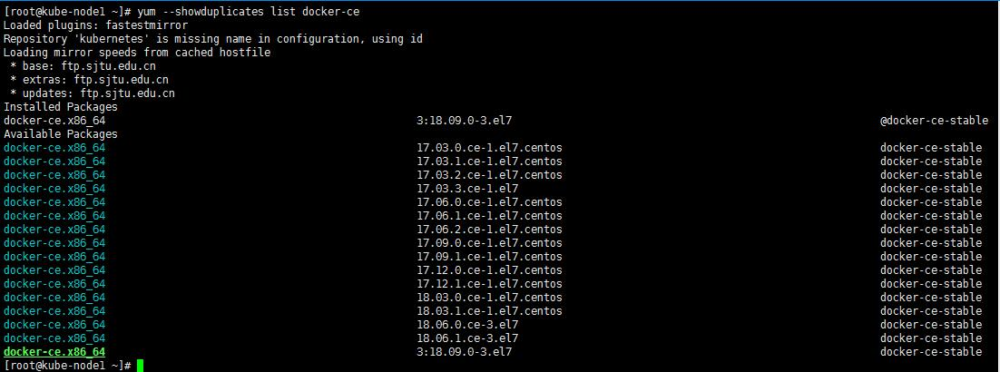

### yum安装软件包时指定版本

* 查看某个软件包在仓库中的所有版本：

```
~]# yum --showduplicates list  docker-ce
```



* 安装指定版本的软件包
* __注：安装时软件包名称格式必须更改为正确的格式：`PACKAGE_NAME-VERSION_NUMBER`__

```
~]# yum -y install docker-ce-17.12.1.ce
```

* 软件包名称：__`docker-ce`__
* 中间使用`-`连接
* 软件包版本：__`17.12.1.ce`__